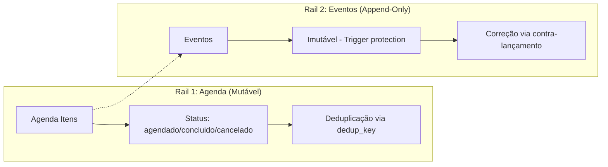
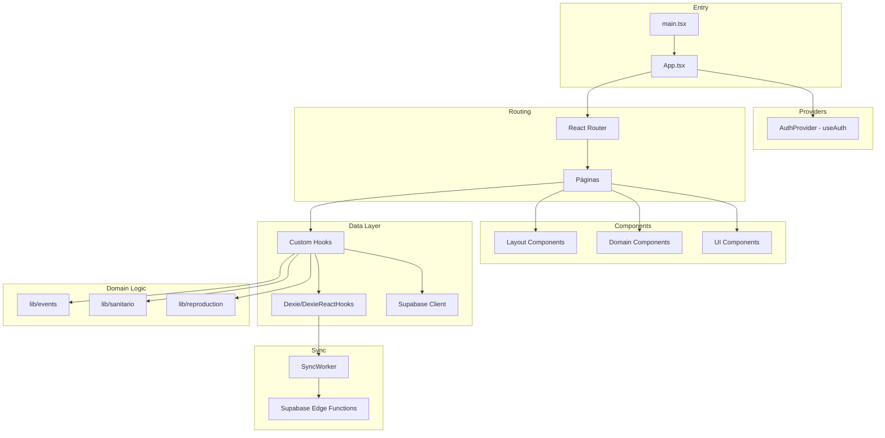

# Análise Arquitetural Completa do Projeto GestaoAgro (RebanhoSync)

## 1. Visão Geral do Projeto

O **RebanhoSync** (também identificado como GestaoAgro) é um sistema de gestão pecuária offline-first com suporte a multi-tenancy, sincronização bidirecional e controles de acesso baseados em funções. O projeto utiliza React 19 com TypeScript no frontend, Supabase (PostgreSQL) como backend, e Dexie.js (IndexedDB) para armazenamento local offline.

## 2. Representação Visual da Estrutura Hierárquica

```mermaid
graph TD
    subgraph "Raiz do Projeto"
        Root["./"] --> Config["Arquivos de Configuração"]
        Root --> Docs["/docs"]
        Root --> Src["/src"]
        Root --> Public["/public"]
        Root --> Plans["/plans"]
    end

    subgraph "/docs - Documentação"
        Docs --> Arch["ARCHITECTURE.md"]
        Docs --> Database["DB.md"]
        Docs --> Security["RLS.md"]
        Docs --> Offline["OFFLINE.md"]
        Docs --> Contracts["CONTRACTS.md"]
        Docs --> Routes["ROUTES.md"]
        Docs --> Analysis["/analysis"]
        Docs --> Review["/review"]
        Docs --> SQL["/sql"]
    end

    subgraph "/src - Código Fonte"
        Src --> Entry["main.tsx, App.tsx"]
        Src --> Components["/components"]
        Src --> Pages["/pages"]
        Src --> Hooks["/hooks"]
        Src --> Lib["/lib"]
        Src --> Utils["/utils"]
    end

    subgraph "/src/components - Componentes UI"
        Components --> Auth["/auth"]
        Components --> Layout["/layout"]
        Components --> Events["/events"]
        Components --> Manejo["/manejo"]
        Components --> Members["/members"]
        Components --> UI["/ui"]
    end

    subgraph "/src/lib - Biblioteca de Domínio"
        Lib --> OfflineLib["/offline"]
        Lib --> EventsLib["/events"]
        Lib --> Domain["/domain"]
        Lib --> Sanitario["/sanitario"]
        Lib --> Reproduction["/reproduction"]
        Lib --> SupabaseClient["supabase.ts"]
        Lib --> Env["env.ts"]
    end

    subgraph "/src/pages - Rotas da Aplicação"
        Pages --> AuthPages["Login, SignUp, SelectFazenda"]
        Pages --> FarmPages["CriarFazenda, EditarFazenda"]
        Pages --> AnimalPages["Animais, AnimalNovo, AnimalEditar, AnimalDetalhe"]
        Pages --> LotePages["Lotes, LoteNovo, LoteEditar, LoteDetalhe"]
        Pages --> PastoPages["Pastos, PastoNovo, PastoEditar, PastoDetalhe"]
        Pages --> EventPages["Eventos, Registrar, Agenda"]
        Pages --> FinancePages["Financeiro, Contrapartes"]
        Pages --> MemberPages["Membros, AdminMembros"]
        Pages --> ReportPages["Dashboard, ReproductionDashboard"]
    end
```



## 3. Inventário Técnico e Stack Tecnológico

### 3.1 Frontend
| Categoria | Tecnologia | Versão |
|-----------|------------|--------|
| Framework UI | React | 19.2.3 |
| Linguagem | TypeScript | 5.5.3 |
| Build Tool | Vite | 6.3.4 |
| Estilização | Tailwind CSS | 3.4.11 |
| Componentes UI | Radix UI + shadcn/ui | Diversos |
| Estado Global | React Context API | Native |
| Query Cache | TanStack React Query | 5.56.2 |
| Router | React Router DOM | 6.26.2 |
| Validação | Zod | 3.23.8 |
| Formulários | React Hook Form | 7.53.0 |
| Ícones | Lucide React | 0.462.0 |
| Gráficos | Recharts | 2.12.7 |
| Dates | date-fns | 3.6.0 |

### 3.2 Backend e Dados
| Categoria | Tecnologia |
|-----------|------------|
| Banco de Dados | PostgreSQL (Supabase) |
| Auth | Supabase Auth |
| Armazenamento Local | Dexie.js 4.3.0 |
| Edge Functions | Supabase Functions |

### 3.3 Desenvolvimento
| Categoria | Tecnologia |
|-----------|------------|
| Package Manager | pnpm |
| Linting | ESLint 9.9.0 |
| Formatting | Prettier 3.3.3 |
| Testing | Vitest 4.0.18 |

## 4. Análise Detalhada por Diretório

### 4.1 `/src` - Código Fonte Principal

#### 4.1.1 Arquivos de Entrada
- **[`main.tsx`](src/main.tsx)**: Ponto de entrada React, inicializa AuthProvider e App
- **[`App.tsx`](src/App.tsx)**: Configuração de rotas React Router com proteção por auth e fazenda
- **[`globals.css`](src/globals.css)**: Estilos globais e variáveis CSS do Tailwind

#### 4.1.2 `/src/components` - Componentes React

| Diretório | Propósito | Arquivos Principais |
|-----------|-----------|---------------------|
| `/auth` | Componentes de autenticação | AuthGate, RequireAuth, RequireFarm |
| `/layout` | Layout da aplicação | AppShell, TopBar, SideNav |
| `/events` | Formulários de eventos | ReproductionForm |
| `/manejo` | Operações de manejo | AdicionarAnimaisLote, MoverAnimalLote, MudarPastoLote, TrocarTouroLote |
| `/members` | Gestão de membros | InviteMemberDialog, MemberRoleDialog, RoleBadge |
| `/ui` | Componentes shadcn/ui | 50+ componentes baseados em Radix UI |

#### 4.1.3 `/src/pages` - Páginas da Aplicação

O diretório contém 40+ páginas organizadas por domínio funcional:

- **Autenticação**: Login, SignUp, AcceptInvite
- **Fazenda**: CriarFazenda, EditarFazenda, SelectFazenda
- **Animais**: Animais, AnimalNovo, AnimalEditar, AnimalDetalhe
- **Lotes**: Lotes, LoteNovo, LoteEditar, LoteDetalhe
- **Pastos**: Pastos, PastoNovo, PastoEditar, PastoDetalhe
- **Eventos**: Registrar, Eventos, Agenda
- **Financeiro**: Financeiro, Contrapartes
- **Gestão**: Membros, AdminMembros, Perfil
- **Relatórios**: Dashboard, ReproductionDashboard

#### 4.1.4 `/src/hooks` - Custom Hooks

| Arquivo | Responsabilidade |
|---------|------------------|
| [`useAuth.tsx`](src/hooks/useAuth.tsx) | Context de autenticação, gestão de sessão e fazenda ativa |
| [`useCurrentRole.ts`](src/hooks/useCurrentRole.ts) | Hook para obter role atual do usuário |
| [`useLotes.ts`](src/hooks/useLotes.ts) | Hook para gerenciamento de lotes |
| [`useMobile.tsx`](src/hooks/use-mobile.tsx) | Detecção de dispositivos móveis |
| [`useDebouncedValue.ts`](src/hooks/useDebouncedValue.ts) | Valor com debounce |
| [`use-toast.ts`](src/hooks/use-toast.ts) | Sistema de toasts |

#### 4.1.5 `/src/lib` - Biblioteca de Domínio

##### `/lib/offline` - Sistema Offline-First
- **[`db.ts`](src/lib/offline/db.ts)**: Configuração do Dexie (IndexedDB), schema das stores
- **[`types.ts`](src/lib/offline/types.ts)**: 779 linhas de tipos TypeScript para sync, entidades e eventos
- **[`syncWorker.ts`](src/lib/offline/syncWorker.ts)**: Worker de sincronização (intervalo 5s)
- **[`ops.ts`](src/lib/offline/ops.ts)**: Operações locais e rollback
- **[`pull.ts`](src/lib/offline/pull.ts)**: Pull de dados do servidor
- **[`syncOrder.ts`](src/lib/offline/syncOrder.ts)**: Ordenação de operações para sync
- **[`tableMap.ts`](src/lib/offline/tableMap.ts)**: Mapeamento entre tabelas remote e local

##### `/lib/events` - Sistema de Eventos
- **[`buildEventGesture.ts`](src/lib/events/buildEventGesture.ts)**: Builder para criar gestos de eventos
- **[`types.ts`](src/lib/events/types.ts)**: Tipos canônicos de eventos
- **[`validators/`](src/lib/events/validators)**: Validadores por domínio (sanitário, pesagem, movimentação, nutrição, financeiro)
- **[`__tests__/`](src/lib/events/__tests__)**: Testes unitários

##### `/lib/sanitario` - Domínio Sanitário
- **[`service.ts`](src/lib/sanitario/service.ts)**: Lógica de domínio sanitário

##### `/lib/reproduction` - Domínio de Reprodução
- **[`status.ts`](src/lib/reproduction/status.ts)**: Status computation
- **[`linking.ts`](src/lib/reproduction/linking.ts)**: Episode linking
- **[`selectors.ts`](src/lib/reproduction/selectors.ts)**: Seletores para queries
- **[`__tests__/`](src/lib/reproduction/__tests__)**: Testes unitários

##### `/lib/domain` - Domínio Comum
- **[`categorias.ts`](src/lib/domain/categorias.ts)**: Definição de categorias zootécnicas

##### Arquivos de Infraestrutura
- **[`supabase.ts`](src/lib/supabase.ts)**: Cliente Supabase
- **[`env.ts`](src/lib/env.ts)**: Validação de variáveis de ambiente
- **[`utils.ts`](src/lib/utils.ts)**: Funções utilitárias

### 4.2 `/docs` - Documentação

A documentação é bem estruturada e abrangente:

| Arquivo | Conteúdo |
|---------|----------|
| ARCHITECTURE.md | Arquitetura Two Rails, Offline-First |
| DB.md | Schema do banco de dados |
| RLS.md | Segurança, Row Level Security, RBAC |
| OFFLINE.md | Implementação Dexie.js |
| CONTRACTS.md | Contratos da Edge Function sync-batch |
| ROUTES.md | Rotas e proteções |
| E2E_MVP.md | Fluxos de teste |
| ROADMAP.md | Funcionalidades planejadas |
| TECH_DEBT.md | Dívidas técnicas |

Subdiretórios:
- `/analysis`: Análises de campos e domínios
- `/review`: Auditorias e relatórios
- `/adr`: Architectural Decision Records
- `/sql`: Migrations e queries

### 4.3 `/public` - Arquivos Estáticos

- `favicon.ico`: Ícone do site
- `placeholder.svg`: Imagem placeholder
- `robots.txt`: Diretivas para crawlers

## 5. Padrões Arquiteturais Identificados

### 5.1 Two Rails Pattern
O sistema implementa o padrão Two Rails para separar intenção de execução:



### 5.2 Offline-First com Gesture-Based Sync
Fluxo de sincronização orientado a gestos:

1. UI cria operação → `createGesture()` gera `client_tx_id`
2. Cliente aplica mudança otimistamente no Dexie
3. Worker envia batch para `/functions/v1/sync-batch`
4. Servidor retorna APPLIED/APPLIED_ALTERED/REJECTED
5. Em caso de REJECTED: Rollback local via `before_snapshot`

### 5.3 Multi-Tenancy com FKs Compostas
Todas as tabelas de negócio incluem `fazenda_id` para isolamento:

```sql
-- Exemplo de FK composta
CONSTRAINT fk_animais_lote
  FOREIGN KEY (lote_id, fazenda_id)
  REFERENCES lotes (id, fazenda_id);
```

### 5.4 RBAC (Role-Based Access Control)

| Role | Leitura | Escrita Operacional | Escrita Estrutural | Gestão Membros |
|------|---------|---------------------|---------------------|----------------|
| Cowboy | ✅ Total | ✅ Eventos, Agenda | ❌ | ❌ |
| Manager | ✅ Total | ✅ Tudo do Cowboy | ✅ Lotes, Pastos | ❌ |
| Owner | ✅ Total | ✅ Tudo do Manager | ✅ Tudo | ✅ |

## 6. Avaliação de Boas Práticas

### ✅ Práticas Boas Identificadas

1. **Documentação Excepcional**: Documentação abrangente em `/docs` com arquitetura, schema, segurança bem definidos

2. **TypeScript Rigoroso**: Uso extensivo de tipos, interfaces bem definidas em [`types.ts`](src/lib/offline/types.ts) com 779 linhas

3. **Separação de Responsabilidades**: 
   - Componentes UI em `/ui`
   - Lógica de domínio em `/lib`
   - Páginas em `/pages`

4. **Testes Unitários**: Estrutura de testes em `__tests__/` para domínios críticos

5. **Validação de Entrada**: Uso de Zod para validação de schemas

6. **Offline-First Bem Implementado**:
   - Dexie stores para estado local
   - Queue system para sync
   - Rollback determinístico

7. **Componentização UI**: shadcn/ui com Radix UI para acessibilidade

### ⚠️ Pontos de Atenção

1. **Arquivos Grandes**: Algumas páginas têm >1000 linhas (Registrar.tsx tem 60k+ chars)

2. **Mistura de Responsabilidades**: Páginas contêm lógica de UI, estado e mutation

3. **Ausência de React Query em Alguns Lugares**: Uso inconsistente do TanStack React Query

4. **Configuração TypeScript Liberal**:
   ```json
   {
     "noImplicitAny": false,
     "noUnusedParameters": false,
     "noUnusedLocals": false,
     "strictNullChecks": false
   }
   ```

5. **Componentes Não Encontrados**: Alguns imports referenciados não existem no filesystem

## 7. Problemas e Oportunidades de Melhoria

### 7.1 Problemas Críticos

| Problema | Impacto | Recomendação |
|----------|---------|--------------|
| Components.json menciona caminho não usado (`app/**/*.{ts,tsx}`) | Configuração inconsistente | Remover referência a `app/` |
| Arquivos de páginas muito grandes | Dificuldade de manutenção | Extrair componentes menores |
| Ausência de Lazy Loading | Bundle grande inicial | Implementar React.lazy() |

### 7.2 Melhorias Recomendadas

#### Estrutura de Código
1. **Extração de Componentes de Página**: Quebrar páginas grandes em subcomponentes
2. **Custom Hooks para Lógica de Página**: Extrair lógica de mutation para hooks customizados
3. **Consolidação de Componentes UI**: Alguns componentes shadcn podem ser simplificados

#### Configuração TypeScript
1. Habilitar `strictNullChecks` progressivamente
2. Adicionar `noImplicitAny` gradualmente
3. Remover parâmetros e variáveis não utilizadas

#### Performance
1. Implementar code splitting com React.lazy()
2. Adicionar virtualização para listas grandes
3. Otimizar re-renders com memo()

#### Testes
1. Expandir cobertura de testes unitários
2. Adicionar testes de integração
3. Configurar E2E com Playwright/Cypress

#### Documentação
1. Adicionar JSDoc em funções expostas
2. Criar história de componentes
3. Documentar decisões arquiteturais no formato ADR

## 8. Estrutura de Dependências



## 9. Métricas do Projeto

| Métrica | Valor |
|---------|-------|
| Total de arquivos TypeScript/TSX | ~150+ |
| Páginas | 40+ |
| Componentes UI | 50+ |
| Lines de tipos (types.ts) | 779 |
| Documentos markdown | 30+ |
| Dependências em package.json | 60+ |
| Versão do schema Dexie | 6 |

## 10. Conclusão

O projeto RebanhoSync apresenta uma arquitetura bem fundamentada e madura para uma aplicação offline-first de gestão pecuária. Os padrões de Two Rails, sincronização baseada em gestos e segurança multi-tenant estão bem implementados e documentados.

As principais oportunidades de melhoria concentram-se em:
1. Refatoração de páginas grandes
2. Habilitação progressiva de strict TypeScript
3. Expansão de testes
4. Otimização de performance

A equipe demonstrou conhecimento sólido em arquitetura de software, com documentação exemplar que serve como referência para outros projetos similares.
