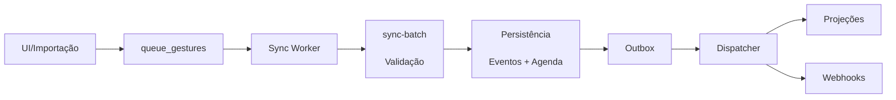

# Plano Técnico de Unificação e Implantação dos Fluxos de Eventos

**Status:** Normativo (Plano Técnico)  
**Baseline:** ef123ac  
**Última Atualização:** 2026-02-17  
**Derivado por:** Antigravity Docs Update — Rev D

---

## 1. Objetivo

Unificar o modelo de eventos para:

1. Padronizar contratos de dados, validações e tipagens.
2. Fechar lacunas de integridade entre os domínios.
3. Implantar fluxo consistente de captura, sincronização, processamento e propagação.
4. Garantir rastreabilidade auditável ponta a ponta.

**Escopo:** Domínios `sanitario`, `pesagem`, `nutricao`, `movimentacao`, `reproducao`, `financeiro` e `agenda`.

---

## 2. Baseline Analisada

### 2.1 Fontes Principais

Análise baseada em:

1. **Documentação normativa:**
   - `docs/ARCHITECTURE.md`
   - `docs/DB.md`
   - `docs/CONTRACTS.md`
   - `docs/OFFLINE.md`
   - `docs/EVENTOS_AGENDA_SPEC.md`
   - `docs/E2E_MVP.md`
   - `docs/RLS.md`

2. **Migrations (schema):**
   - `supabase/migrations/0001_init.sql` (estrutura inicial)
   - `supabase/migrations/0004_rls_hardening.sql` (RLS)
   - `supabase/migrations/0023_hardening_eventos_financeiro.sql` (checks financeiro)
   - `supabase/migrations/0024_hardening_eventos_nutricao.sql` (checks nutrição)
   - `supabase/migrations/0025_hardening_eventos_movimentacao.sql` (constraints movimentação)
   - `supabase/migrations/0026_fk_eventos_financeiro_contrapartes.sql` (FK contrapartes)
   - `supabase/migrations/0028_sanitario_agenda_engine.sql` (agenda automática sanitária)
   - `supabase/migrations/0035_reproducao_hardening_v1.sql` (reprodução v1)
   - `supabase/migrations/0037_security_hardening_review.sql` (security review)

3. **Edge Functions:**
   - `supabase/functions/sync-batch/index.ts`

4. **Cliente (Offline):**
   - `src/lib/offline/types.ts`
   - `src/lib/offline/tableMap.ts`
   - `src/lib/offline/syncWorker.ts`

**Janela de análise:** Migrations `0001` a `0037` (baseline ef123ac).

---

## 3. Estado Atual

### 3.1 Two Rails (Eventos Append-Only + Agenda Mutável)

O sistema implementa o padrão Two Rails conforme especificado em `ARCHITECTURE.md` e `EVENTOS_AGENDA_SPEC.md`:

**Rail 1 (Eventos):**

- Tabela `eventos` (envelope) + Tabelas satélites 1:1 por domínio (`eventos_sanitario`, etc.)
- **Append-only**: Trigger `prevent_business_update` bloqueia UPDATE de campos de negócio (PM: `0001_init.sql:81-95`)
- **Correção histórica**: Via novo evento com `corrige_evento_id`
- **RLS**: Membership-based (PM: `0001_init.sql:718-747`, `0004_rls_hardening.sql`)

**Rail 2 (Agenda):**

- Tabela `agenda_itens` (mutável)
- **Estados**: `agendado` → `concluido` | `cancelado`
- **Dedup**: Unique parcial em (`fazenda_id`, `dedup_key`) para `status='agendado'` (PM: `0001_init.sql:522-524`)
- **Agenda automática sanitária**: Implementada via `0028_sanitario_agenda_engine.sql`

**PM:** `docs/ARCHITECTURE.md:24-49`, `docs/EVENTOS_AGENDA_SPEC.md:11-51`

### 3.2 Estrutura Comum (Envelope) — `eventos`

Todos os tipos de evento herdam esta estrutura (PM: `0001_init.sql:541-595`):

| Campo                 | Tipo             | Obrigatório | Validação Atual           | Relacionamento                       |
| --------------------- | ---------------- | ----------- | ------------------------- | ------------------------------------ |
| `id`                  | uuid             | Sim         | PK                        | -                                    |
| `fazenda_id`          | uuid             | Sim         | not null                  | FK `fazendas(id)`                    |
| `dominio`             | `dominio_enum`   | Sim         | enum                      | -                                    |
| `occurred_at`         | timestamptz      | Sim         | not null                  | -                                    |
| `occurred_on`         | date (generated) | Sim         | derivado de `occurred_at` | -                                    |
| `animal_id`           | uuid             | Não         | opcional                  | FK composta `animais(id,fazenda_id)` |
| `lote_id`             | uuid             | Não         | opcional                  | FK composta `lotes(id,fazenda_id)`   |
| `source_task_id`      | uuid             | Não         | opcional                  | referência agenda                    |
| `source_tx_id`        | uuid             | Não         | opcional                  | rastreabilidade técnica              |
| `source_client_op_id` | uuid             | Não         | opcional                  | rastreabilidade técnica              |
| `corrige_evento_id`   | uuid             | Não         | opcional                  | self-FK lógica                       |
| `observacoes`         | text             | Não         | opcional                  | -                                    |
| `payload`             | jsonb            | Sim         | default `{}`              | -                                    |
| `client_id`           | text             | Sim         | not null                  | id origem                            |
| `client_op_id`        | uuid             | Sim         | idempotência              | chave técnica                        |
| `client_tx_id`        | uuid             | Não         | agrupador transação       | chave técnica                        |
| `client_recorded_at`  | timestamptz      | Sim         | not null                  | -                                    |
| `server_received_at`  | timestamptz      | Sim         | default `now()`           | -                                    |
| `deleted_at`          | timestamptz      | Não         | soft delete               | -                                    |
| `created_at`          | timestamptz      | Sim         | default `now()`           | -                                    |
| `updated_at`          | timestamptz      | Sim         | default `now()`           | -                                    |

**Regras globais:**

1. Trigger `prevent_business_update` (append-only de negócio) — PM: `0001_init.sql:577-579`
2. RLS por `has_membership(fazenda_id)` para leitura e inserção — PM: `0001_init.sql:741`, `0004_rls_hardening.sql`
3. Correção por novo evento (`corrige_evento_id`), sem update de negócio — PM: `docs/EVENTOS_AGENDA_SPEC.md:20-27`

### 3.3 Estruturas por Domínio (Tabelas de Detalhe 1:1)

Todos os detalhes possuem:

1. `evento_id` (PK, FK para `eventos(id,fazenda_id)`)
2. `fazenda_id`
3. `payload`
4. metadados de sync (`client_*`, `server_received_at`)
5. `deleted_at`, `created_at`, `updated_at`
6. trigger append-only

#### 3.3.1 Sanitário — `eventos_sanitario`

| Campo        | Tipo                  | Obrigatório | Validação Atual                                 | Relacionamento              |
| ------------ | --------------------- | ----------- | ----------------------------------------------- | --------------------------- |
| `evento_id`  | uuid                  | Sim         | PK                                              | FK `eventos(id,fazenda_id)` |
| `fazenda_id` | uuid                  | Sim         | not null                                        | tenant                      |
| `tipo`       | `sanitario_tipo_enum` | Sim         | enum (`vacinacao`,`vermifugacao`,`medicamento`) | -                           |
| `produto`    | text                  | Sim         | not null                                        | -                           |
| `payload`    | jsonb                 | Sim         | default `{}`                                    | extensão de domínio         |

**PM:** `0001_init.sql:597-614`

**Observação:** Campos extras (fabricante, dose, via, lote) não estão tipados no schema principal e devem ser tratados via `payload` até padronização v2.

#### 3.3.2 Pesagem — `eventos_pesagem`

| Campo        | Tipo          | Obrigatório | Validação Atual       |
| ------------ | ------------- | ----------- | --------------------- |
| `evento_id`  | uuid          | Sim         | PK                    |
| `fazenda_id` | uuid          | Sim         | not null              |
| `peso_kg`    | numeric(10,2) | Sim         | `check (peso_kg > 0)` |
| `payload`    | jsonb         | Sim         | default `{}`          |

**PM:** `0001_init.sql:615-631`

#### 3.3.3 Movimentação — `eventos_movimentacao`

| Campo           | Tipo  | Obrigatório | Validação Atual                       | Relacionamento                       |
| --------------- | ----- | ----------- | ------------------------------------- | ------------------------------------ |
| `evento_id`     | uuid  | Sim         | PK                                    | FK `eventos(id,fazenda_id)`          |
| `fazenda_id`    | uuid  | Sim         | not null                              | tenant                               |
| `from_lote_id`  | uuid  | Não         | sem check                             | sem FK dedicada na tabela de detalhe |
| `to_lote_id`    | uuid  | Não         | constraint destino obrigatório (0025) | sem FK dedicada na tabela de detalhe |
| `from_pasto_id` | uuid  | Não         | sem check                             | sem FK dedicada na tabela de detalhe |
| `to_pasto_id`   | uuid  | Não         | constraint destino obrigatório (0025) | sem FK dedicada na tabela de detalhe |
| `payload`       | jsonb | Sim         | default `{}`                          | extensão de domínio                  |

**Regra de integridade relevante:**

1. `sync-batch` aplica pré-validação anti-teleporte: `UPDATE animais.lote_id` só é aceito quando existe `eventos` de `movimentacao` + `eventos_movimentacao` correlato no mesmo `client_tx_id`.
2. **✅ IMPLEMENTADO (0025):** Constraints de destino obrigatório e origem ≠ destino adicionados.

**PM (tabela):** `0001_init.sql:650-669`  
**PM (constraints):** `0025_hardening_eventos_movimentacao.sql:6-10`  
**PM (anti-teleport):** `docs/EVENTOS_AGENDA_SPEC.md:53-68`, `docs/CONTRACTS.md:71`

#### 3.3.4 Nutrição — `eventos_nutricao`

| Campo           | Tipo          | Obrigatório | Validação Atual                                                |
| --------------- | ------------- | ----------- | -------------------------------------------------------------- |
| `evento_id`     | uuid          | Sim         | PK                                                             |
| `fazenda_id`    | uuid          | Sim         | not null                                                       |
| `alimento_nome` | text          | Não         | sem check                                                      |
| `quantidade_kg` | numeric(12,3) | Não         | ✅ `check (quantidade_kg is null or quantidade_kg > 0)` (0024) |
| `payload`       | jsonb         | Sim         | default `{}`                                                   |

**PM (tabela):** `0001_init.sql:632-649`  
**PM (check):** `0024_hardening_eventos_nutricao.sql:12`

#### 3.3.5 Financeiro — `eventos_financeiro`

| Campo            | Tipo                   | Obrigatório | Validação Atual                     | Relacionamento              |
| ---------------- | ---------------------- | ----------- | ----------------------------------- | --------------------------- |
| `evento_id`      | uuid                   | Sim         | PK                                  | FK `eventos(id,fazenda_id)` |
| `fazenda_id`     | uuid                   | Sim         | not null                            | tenant                      |
| `tipo`           | `financeiro_tipo_enum` | Sim         | enum (`compra`,`venda`)             | -                           |
| `valor_total`    | numeric(14,2)          | Sim         | ✅ `check (valor_total > 0)` (0023) | -                           |
| `contraparte_id` | uuid                   | Não         | opcional                            | ✅ FK composta (0026)       |
| `payload`        | jsonb                  | Sim         | default `{}`                        | extensão de domínio         |

**PM (tabela):** `0001_init.sql:688-706`  
**PM (check):** `0023_hardening_eventos_financeiro.sql:13`  
**PM (FK):** `0026_fk_eventos_financeiro_contrapartes.sql`

#### 3.3.6 Reprodução — `eventos_reproducao`

| Campo        | Tipo              | Obrigatório | Validação Atual                                  |
| ------------ | ----------------- | ----------- | ------------------------------------------------ |
| `evento_id`  | uuid              | Sim         | PK                                               |
| `fazenda_id` | uuid              | Sim         | not null                                         |
| `tipo`       | `repro_tipo_enum` | Sim         | enum (`cobertura`,`IA`,`diagnostico`,`parto`)    |
| `macho_id`   | uuid              | Não         | validação sync-batch para cobertura/IA           |
| `payload`    | jsonb             | Sim         | default `{}` (schema_version, episode_evento_id) |

**PM (tabela):** `0001_init.sql:670-687`  
**PM (hardening):** `0035_reproducao_hardening_v1.sql`

**Constraints e Validações (Sync-Batch):**

- `payload.schema_version` deve ser 1 (PM: `docs/CONTRACTS.md:72`)
- `macho_id` obrigatório para `tipo = 'cobertura'` ou `tipo = 'IA'` (validação em sync-batch)
- `tipo = 'parto'` deve ter `payload.episode_evento_id` referenciando evento de cobertura ou IA
- `tipo = 'diagnostico'` aceita `episode_evento_id` nulo (marcado como 'unlinked')

### 3.4 Estrutura de Agenda e Protocolos (Rail Mutável)

#### 3.4.1 Agenda — `agenda_itens`

| Campo                      | Tipo                      | Obrigatório | Validação Atual                             | Relacionamento                       |
| -------------------------- | ------------------------- | ----------- | ------------------------------------------- | ------------------------------------ |
| `id`                       | uuid                      | Sim         | PK                                          | -                                    |
| `fazenda_id`               | uuid                      | Sim         | not null                                    | FK `fazendas(id)`                    |
| `dominio`                  | `dominio_enum`            | Sim         | enum                                        | -                                    |
| `tipo`                     | text                      | Sim         | not null                                    | -                                    |
| `status`                   | `agenda_status_enum`      | Sim         | default `agendado`                          | -                                    |
| `data_prevista`            | date                      | Sim         | not null                                    | -                                    |
| `animal_id`                | uuid                      | Não         | `ck_agenda_alvo`                            | FK composta `animais(id,fazenda_id)` |
| `lote_id`                  | uuid                      | Não         | `ck_agenda_alvo`                            | FK composta `lotes(id,fazenda_id)`   |
| `dedup_key`                | text                      | Não         | obrigatória quando `source_kind=automatico` | unique parcial ativo                 |
| `source_kind`              | `agenda_source_kind_enum` | Sim         | default `manual`                            | -                                    |
| `source_ref`               | jsonb                     | Não         | opcional                                    | -                                    |
| `source_client_op_id`      | uuid                      | Não         | opcional                                    | trilha técnica                       |
| `source_tx_id`             | uuid                      | Não         | opcional                                    | trilha técnica                       |
| `source_evento_id`         | uuid                      | Não         | opcional                                    | referência evento de conclusão       |
| `protocol_item_version_id` | uuid                      | Não         | opcional                                    | referência protocolo/versão          |
| `interval_days_applied`    | int                       | Não         | opcional                                    | agenda automática                    |
| `payload`                  | jsonb                     | Sim         | default `{}`                                | extensão                             |

**PM:** `0001_init.sql:476-537`  
**PM (agenda engine):** `0028_sanitario_agenda_engine.sql`

---

## 4. Padrões Comuns e Divergências

### 4.1 Padrões Comuns Identificados

1. **Two Rails:** `eventos` append-only + `agenda_itens` mutável.
2. **Modelo de detalhe 1:1** por domínio.
3. **Metadados de sync** em todas as tabelas (`client_*`, `server_received_at`).
4. **Multi-tenant** por `fazenda_id` + RLS por membership.
5. **Correção histórica** por novo evento, sem sobrescrita.

### 4.2 Divergências e Lacunas

#### ✅ RESOLVIDAS (Baseline ef123ac):

1. **Validações assimétricas**: `peso_kg > 0` existia; `valor_total`, `quantidade_kg` AGORA têm checks equivalentes (0023, 0024).
2. **Integridade referencial (contrapartes)**: `contraparte_id` AGORA tem FK composta (0026).
3. **Validação movimentação**: Destino obrigatório e origem ≠ destino AGORA têm constraints (0025).

#### 🔄 PENDENTES (Para v2):

1. **Cobertura de UI desigual**: `sanitario/pesagem/movimentacao` ativos; `nutricao/financeiro` sem fluxo completo em tela.
2. **Heterogeneidade semântica**: Parte dos atributos sanitários aparece nos documentos, mas no schema atual está concentrada no `payload`.
3. **Contratos de tipos com drift**: `src/lib/offline/types.ts` não reflete 100% das colunas de `eventos` (ex.: `source_tx_id`, `source_client_op_id`) e omite `server_received_at` em `EventoFinanceiro`.
4. **Nomenclatura de papéis inconsistente na documentação**: `admin` vs `manager` (docs vs código usa `owner`/`manager`/`cowboy`).

---

## 5. Modelo Unificado v2 (Proposta)

### 5.1 Princípios

1. Preservar append-only e idempotência.
2. Padronizar contratos sem quebrar sync offline existente.
3. Tipar campos de alto valor analítico/auditoria; manter extensões em `payload`.
4. Migrar por estratégia expand-migrate-contract.

### 5.2 Evolução de Schema Proposta

#### 5.2.1 Campos Novos no Envelope `eventos`

| Campo Novo          | Tipo | Objetivo                                |
| ------------------- | ---- | --------------------------------------- |
| `tipo`              | text | subtipo canônico dentro do domínio      |
| `schema_version`    | int  | versão do contrato (v1, v2...)          |
| `correlation_id`    | uuid | rastrear fluxo de negócio ponta a ponta |
| `causation_id`      | uuid | evento/ação que originou o atual        |
| `composite_root_id` | uuid | encadear eventos compostos              |
| `producer`          | text | origem (`ui`, `import`, `integration`)  |

#### 5.2.2 Regras Mínimas por Domínio (v2)

| Domínio        | Regras Obrigatórias v2                                                                                                                 |
| -------------- | -------------------------------------------------------------------------------------------------------------------------------------- |
| `sanitario`    | `tipo`, `produto` obrigatórios; `payload` com schema versionado para dose, via, lote e validade                                        |
| `pesagem`      | manter `peso_kg > 0`; incluir faixa plausível por categoria no backend                                                                 |
| `movimentacao` | ✅ exigir `to_lote_id` ou `to_pasto_id` (JÁ IMPLEMENTADO 0025); bloquear origem=destino; manter anti-teleporte                         |
| `nutricao`     | ✅ exigir `quantidade_kg > 0` quando não null (JÁ IMPLEMENTADO 0024); exigir `alimento_nome`; unidade padrão em payload (`kg`,`g`,`l`) |
| `financeiro`   | ✅ exigir `valor_total > 0` (JÁ IMPLEMENTADO 0023); `contraparte_id` obrigatória quando `tipo in ('compra','venda')`                   |

#### 5.2.3 Eventos Compostos

Padrão: um `composite_root_id` por operação multi-entidade.

1. `movimentacao_com_estado`: `eventos` + `eventos_movimentacao` + `UPDATE animais`.
2. `execucao_agenda`: mudança `agenda_itens.status` + evento(s) de execução vinculados.
3. `sanitario_com_custo`: evento sanitário + evento financeiro associado por `correlation_id`.
4. `nutricao_com_custo`: evento nutrição + evento financeiro associado por `correlation_id`.

### 5.3 Estados e Transições

#### 5.3.1 Estados de Evento (Processamento)

Implementar em tabela técnica `eventos_pipeline` (não no evento de negócio):

1. `capturado` → `validado` → `persistido` → `publicado`.
2. `capturado` → `rejeitado` (erro de regra ou contrato).
3. `persistido` → `corrigido` (quando houver evento com `corrige_evento_id`).

#### 5.3.2 Estados de Agenda

Manter `agendado`, `concluido`, `cancelado`, com guardas:

1. `agendado → concluido`: requer `source_evento_id` ou justificativa técnica.
2. `agendado → cancelado`: requer justificativa em `observacoes`.
3. Bloquear reabertura sem evento de replanejamento explícito.

---

## 6. Arquitetura de Integração

### 6.1 Fluxo Alvo

1. **Captura** (UI/importação/API) → `queue_gestures` / `queue_ops` (offline-first).
2. **Ingestão** (`sync-batch`) com validação:
   1. membership/RLS
   2. contrato por domínio
   3. anti-teleporte e dedup
3. **Persistência atomica** no rail de eventos/agenda.
4. **Escrita em outbox** (`eventos_outbox`) no mesmo commit.
5. **Dispatcher assíncrono** publica para:
   1. Projeções internas (timeline, dashboards, relatórios)
   2. Integrações externas (ERP, BI, webhooks)
6. **Consumo idempotente** por `event_id` + `schema_version`.

### 6.2 Componentes Técnicos

1. `sync-batch` v2 com validadores por domínio.
2. `eventos_outbox` com status (`pending`,`sent`,`failed`) e retry exponencial.
3. `vw_eventos_unificados` para leitura padronizada cross-domínio.
4. `schema registry` simples (JSON Schema versionado em repositório).
5. Projeções denormalizadas para consulta operacional (`timeline`, `agenda`, `financeiro`).

### 6.3 Propagação entre Sistemas

1. **Interno:** Leitura direta no Postgres + views/materialized views.
2. **Externo:** Webhook assinado/HMAC e lote por janela temporal.
3. **Observabilidade:** Métricas de latência, rejeição e lag de outbox.

---

## 7. Versionamento e Migração de Dados

### 7.1 Estratégia de Versionamento

1. **Banco:** Migrations sequenciais (`00xx`) com compatibilidade backward.
2. **Contratos de evento:** `schema_version` inteiro no envelope.
3. **API sync:** Header ou campo `contract_version` (default v1, novo v2).

### 7.2 Plano de Migração (Expand-Migrate-Contract)

#### Fase A - Expandir

1. Adicionar colunas novas (`tipo`,`schema_version`,`correlation_id`, etc.) nullable.
2. Criar constraints novas como `NOT VALID`.
3. Criar `eventos_outbox` e `eventos_pipeline`.

#### Fase B - Migrar

1. Backfill por domínio:
   1. `schema_version=1` para legado.
   2. gerar `tipo` por regra de domínio.
   3. popular `correlation_id/composite_root_id` quando inferível.
2. Adequar dados inconsistentes (`valor_total<=0`, `quantidade_kg<=0`, movimentações incompletas) para rejeição controlada ou correção.

#### Fase C - Contrair

1. Tornar constraints obrigatórias (`VALIDATE CONSTRAINT` + `NOT NULL`).
2. Trocar leituras para `vw_eventos_unificados`.
3. Remover caminhos legados do cliente quando adoção > 95%.

### 7.3 Compatibilidade de Cliente Offline

1. `sync-batch` aceita v1 e v2 durante janela de transição.
2. Cliente antigo continua escrevendo v1; servidor enriquece metadados.
3. Feature flag por fazenda para ativar regras estritas gradualmente.

---

## 8. Segurança, Auditoria e Rastreabilidade

### 8.1 Segurança

1. Manter RLS em todas as tabelas de evento/agenda.
2. Reforçar separação de privilégios por role para operações sensíveis.
3. Assinatura HMAC para webhooks de propagação externa.
4. Criptografia em trânsito (TLS) e em repouso (padrão plataforma).

### 8.2 Auditoria

1. Append-only preservado.
2. Log técnico imutável por operação (`client_op_id`, `client_tx_id`, usuário, timestamp).
3. Tabela `eventos_auditoria` para trilha de aprovação/ação administrativa.
4. Encadeamento de correção por `corrige_evento_id`.

### 8.3 Rastreabilidade Operacional

1. `correlation_id` para cadeia completa agenda → evento → financeiro.
2. `causation_id` para causalidade.
3. Relatório de proveniência por origem (`producer`).

---

## 9. Testes e Validação

### 9.1 Camadas de Teste

1. **Unitários:** Validadores por domínio e dedup.
2. **Integração:** `sync-batch` com cenários APPLIED/APPLIED_ALTERED/REJECTED.
3. **Contrato:** JSON Schema v1/v2 e compatibilidade.
4. **Migração:** Testes de backfill e rollback de dados.
5. **E2E:** Fluxos offline-first (captura, sync, rejeição, rollback local).
6. **Performance:** Carga de batch e throughput outbox.
7. **Segurança:** Testes de RLS por role e tenant isolation.

### 9.2 Critérios Mínimos de Aceite Técnico

1. 0 regressão de integridade referencial.
2. > = 99% de lotes sincronizados sem erro em ambiente piloto.
3. 100% dos eventos v2 com `schema_version` e `tipo` preenchidos.
4. Reprocessamento de rejeição validado em todos os domínios.
5. Dashboards e timeline lendo de modelo unificado sem divergência.

---

## 10. Cronograma de Implantação em Fases

### Fase 0 - Planejamento Detalhado (Semana 1)

1. Fechar ADRs de modelo unificado.
2. Definir schemas JSON por domínio.

**Aceite:**

1. ADR aprovado por arquitetura e produto.
2. Especificações versionadas publicadas.

### Fase 1 - Fundação de Dados (Semanas 2-3)

1. Migrations de expansão (`eventos` v2, outbox, pipeline, constraints `NOT VALID`).
2. Ajustes em `sync-batch` para v2 com compatibilidade v1.

**Aceite:**

1. Migrations aplicam sem downtime.
2. Testes de integração verdes.

### Fase 2 - Validação por Domínio (Semanas 4-5)

1. Implementar regras obrigatórias por domínio.
2. Uniformizar contratos de erro por campo/regra.

**Aceite:**

1. Suite de contrato 100% aprovada.
2. Rejeições explícitas por `reason_code` padronizado.

### Fase 3 - UI e Experiência Operacional (Semanas 6-7)

1. Habilitar formulários de `nutricao` e `financeiro`.
2. Evoluir telas de eventos/agenda com detalhes unificados e rastreabilidade.

**Aceite:**

1. Registro completo dos 5 domínios na UI.
2. Timeline e filtros funcionando por domínio/tipo.

### Fase 4 - Migração e Backfill (Semanas 8-9)

1. Executar backfill histórico.
2. Corrigir dados inválidos mapeados no diagnóstico.

**Aceite:**

1. 100% eventos históricos com `schema_version`.
2. Relatório de inconsistências zerado ou com exceções aprovadas.

### Fase 5 - Piloto Controlado (Semanas 10-11)

1. Ativar feature flag v2 em fazendas piloto.
2. Monitorar rejeições, latência e lag de outbox.

**Aceite:**

1. SLA de sync atendido.
2. Sem incidentes de tenant leakage ou perda de evento.

### Fase 6 - Rollout Geral (Semana 12)

1. Expandir para todas as fazendas.
2. Encerrar caminho legado v1 (após janela acordada).

**Aceite:**

1. Adoção > 95% no novo contrato.
2. Plano de rollback documentado e testado.

---

## 11. Documentação Técnica de Referência (Entregáveis)

1. `docs/EVENTOS_MODELO_UNIFICADO_V2.md` - modelo canonicamente tipado.
2. `docs/EVENTOS_CONTRATOS_JSON_SCHEMA.md` - schemas por domínio e exemplos.
3. `docs/EVENTOS_MIGRACAO_V2.md` - runbook de migração/backfill/rollback.
4. `docs/EVENTOS_OPERACAO_E_OBSERVABILIDADE.md` - monitoração, alertas e SLO.
5. `docs/EVENTOS_TEST_PLAN_V2.md` - plano de testes completo.
6. Atualização de `docs/CONTRACTS.md`, `docs/OFFLINE.md`, `docs/RLS.md`, `docs/DB.md`.

---

## 12. Riscos e Mitigações

| Risco                                     | Impacto    | Mitigação                                          |
| ----------------------------------------- | ---------- | -------------------------------------------------- |
| Rejeições altas após regras v2            | Alto       | rollout por feature flag + monitoração por domínio |
| Drift entre schema e tipos TS             | Alto       | CI de comparação schema vs `types.ts`              |
| Quebra em clientes offline antigos        | Médio/Alto | compat v1/v2 e janela de deprecação                |
| Backfill com dados históricos incompletos | Médio      | estratégia de quarentena + correção assistida      |
| Aumento de latência no sync               | Médio      | batch tuning + índices + outbox assíncrono         |

---

## 13. Decisões Imediatas Recomendadas (P0)

1. ✅ **IMPLEMENTADO** (0023, 0024): Checks de negócio para `eventos_financeiro.valor_total > 0`, `eventos_nutricao.quantidade_kg > 0`.
   - **PM:** `0023_hardening_eventos_financeiro.sql:13`, `0024_hardening_eventos_nutricao.sql:12`

2. ✅ **IMPLEMENTADO** (0025): Validação de destino obrigatório em movimentação (`to_lote_id` or `to_pasto_id`).
   - **PM:** `0025_hardening_eventos_movimentacao.sql:6-10`

3. 🔄 **PENDENTE**: Corrigir drift de tipos em `src/lib/offline/types.ts` para espelhar schema atual.
   - **Ação:** Adicionar `source_tx_id`, `source_client_op_id`, `server_received_at` em interfaces TypeScript.
   - **PM:** Comparar `src/lib/offline/types.ts` vs `0001_init.sql:541-706`

4. 🔄 **PENDENTE**: Definir contrato mínimo de `payload` por domínio com `schema_version`.
   - **Ação:** Criar `docs/EVENTOS_CONTRATOS_JSON_SCHEMA.md` com schemas JSON por domínio.

---

## Veja Também

- [MATRIZ_CANONICA_EVENTOS_SCHEMA.md](./MATRIZ_CANONICA_EVENTOS_SCHEMA.md) (baseline Fase 0)
- [RECONCILIACAO_REPORT.md](./review/RECONCILIACAO_REPORT.md) (audit report)
- [ARCHITECTURE.md](./ARCHITECTURE.md) (Two Rails e offline-first)
- [CONTRACTS.md](./CONTRACTS.md) (sync-batch API)
- [EVENTOS_AGENDA_SPEC.md](./EVENTOS_AGENDA_SPEC.md) (regras de negócio)
- [DB.md](./DB.md) (esquema completo do banco)
- [OFFLINE.md](./OFFLINE.md) (Dexie e sincronização)
- [RLS.md](./RLS.md) (segurança e RBAC)
