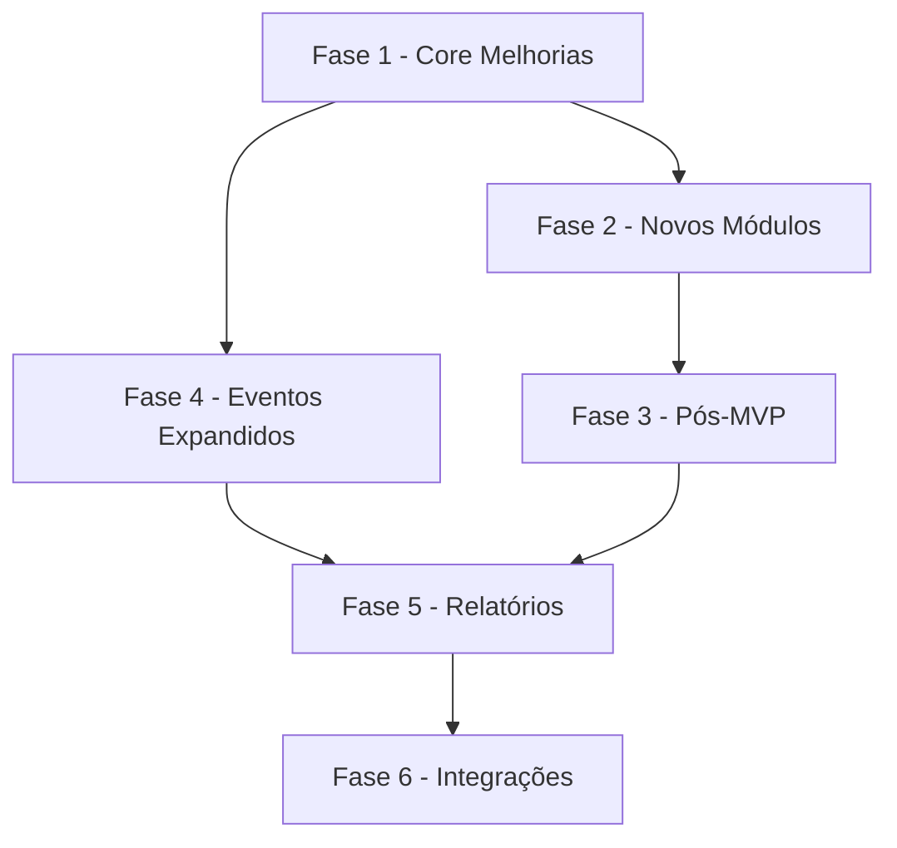

# ROADMAP - Funcionalidades Planejadas

> **Última atualização:** Fevereiro de 2026  
> **Status:** Documento de planejamento para funcionalidades não implementadas

---

## Visão Geral

Este documento registra funcionalidades, melhorias e expansões planejadas para o projeto RebanhoSync. Itens aqui são **não implementados** e servem como referência para priorização futura.

---

## Status Legend

| Símbolo | Significado |
|---------|-------------|
| ✅ | Implementado |
| 🔄 | Em desenvolvimento |
| ⏳ | Planejado |
| ❌ | Despriorizado/Removido |

---

## Fase 1 - Core Melhorias (Alta Prioridade)

### 1.1 Campos Adicionais em Animais

| Campo | Tipo | Prioridade | Status | Dependências |
|-------|------|------------|--------|---------------|
| `origem` | enum | Alta | ⏳ | Migration |
| `numero_brinco` | text | Alta | ⏳ | Migration |
| `raca` | text | Média | ⏳ | Migration |
| `pelagem` | text | Média | ⏳ | Migration |
| `data_castracao` | date | Baixa | ⏳ | - |
| `condicao_corpo` | enum | Baixa | ⏳ | - |
| `peso_entrada` | numeric | Baixa | ⏳ | - |
| `sis_bov_id` | text | Baixa | ⏳ | Pós-MVP |
| `em_sociedade` | boolean | Média | ⏳ | Tabela sociedade |
| `sociedade_id` | uuid | Média | ⏳ | Tabela sociedade |
| `tipo_dono` | enum | Média | ⏳ | Tabela sociedade |
| `categoria_id` | uuid | Média | ⏳ | Tabela categorias |

### 1.2 Campos Adicionais em Pastos

| Campo | Tipo | Prioridade | Status | Dependências |
|-------|------|------------|--------|---------------|
| `tipo_pasto` | enum | Alta | ⏳ | Migration |
| `data_ultimo_rotacionamento` | date | Média | ⏳ | - |
| `coordenadas` | jsonb | Baixa | ⏳ | Pós-MVP (geofeatures) |

### 1.3 Melhorias de UI - Quick Wins (Fase 0)

#### Animais

| Campo | Ação UI | Prioridade | Status |
|-------|---------|------------|--------|
| `data_nascimento` | Exibir no detalhe, solicitar no cadastro | Alta | ⏳ |
| `data_entrada` | Exibir no detalhe, solicitar no cadastro | Alta | ⏳ |
| `pai_id` | Mostrar como opcional/avançado | Alta | ⏳ |
| `mae_id` | Mostrar como opcional/avançado | Alta | ⏳ |
| `nome` | Esconder em "mais detalhes" | Baixa | ⏳ |
| `rfid` | Esconder em "mais detalhes" | Baixa | ⏳ |

#### Pastos

| Campo | Ação UI | Prioridade | Status |
|-------|---------|------------|--------|
| `capacidade_ua` | Exibir no card e formulário | Alta | ⏳ |
| `benfeitorias` | Editor simples (JSON guiado por UI) | Média | ⏳ |

#### Lotes

| Campo | Ação UI | Prioridade | Status |
|-------|---------|------------|--------|
| `status` | Exibir badge de status | Média | ⏳ |
| `pasto_id` | Mostrar nome do pasto vinculado | Alta | ⏳ |
| `touro_id` | Mostrar nome do touro reprodutor | Média | ⏳ |

---

## Fase 2 - Novos Módulos (Média Prioridade)

### 2.1 Sistema de Sociedade de Animais

#### Descrição
Sistema para gerenciar animais de terceiros criados na fazenda em regime de sociedade.

#### Estrutura Planejada

```sql
-- Tabela: animais_sociedade
create table if not exists public.animais_sociedade (
  id uuid primary key default gen_random_uuid(),
  fazenda_id uuid not null references public.fazendas(id) on delete restrict,
  animal_id uuid not null,
  contraparte_id uuid not null,
  percentual numeric(5,2) null,
  inicio date not null default current_date,
  fim date null,
  payload jsonb not null default '{}'::jsonb,
  -- sync metadata
  client_id text not null,
  client_op_id uuid not null,
  client_tx_id uuid null,
  client_recorded_at timestamptz not null,
  server_received_at timestamptz not null default now(),
  deleted_at timestamptz null,
  created_at timestamptz not null default now(),
  updated_at timestamptz not null default now()
);

-- Índices
create unique index if not exists uq_animais_sociedade_ativa
  on public.animais_sociedade (fazenda_id, animal_id)
  where deleted_at is null and fim is null;
```

#### RLS Planejado

```sql
create policy animais_sociedade_select
  on public.animais_sociedade for select
  using (public.has_membership(fazenda_id));

create policy animais_sociedade_write
  on public.animais_sociedade for all
  using (public.has_membership(fazenda_id))
  with check (
    public.has_membership(fazenda_id)
    and public.role_in_fazenda(fazenda_id) in ('owner','manager')
  );
```

#### Impacto no Offline-First

| Store Dexie | Mapeamento | Sync Mode |
|-------------|------------|-----------|
| `state_animais_sociedade` | `animais_sociedade` | state |

### 2.2 Categorias Zootécnicas

#### Descrição
Sistema de categorização automática de animais por idade e sexo (sem peso).

#### Estrutura Planejada

```sql
-- Tabela: categorias_zootecnicas
create table if not exists public.categorias_zootecnicas (
  id uuid primary key default gen_random_uuid(),
  fazenda_id uuid not null references public.fazendas(id) on delete restrict,
  nome text not null,
  sexo public.sexo_enum null,
  aplica_ambos boolean not null default false,
  idade_min_dias int null,
  idade_max_dias int null,
  ativa boolean not null default true,
  payload jsonb not null default '{}'::jsonb,
  -- sync metadata
  client_id text not null,
  client_op_id uuid not null,
  client_tx_id uuid null,
  client_recorded_at timestamptz not null,
  server_received_at timestamptz not null default now(),
  deleted_at timestamptz null,
  created_at timestamptz not null default now(),
  updated_at timestamptz not null default now()
);
```

#### Lógica de Classificação

```typescript
function classificarAnimal(animal: Animal, categorias: CategoriaZootecnica[]): CategoriaZootecnica | null {
  const idadeDias = diferencaDias(new Date(), animal.data_nascimento);
  
  return categorias.find(cat => {
    const sexoMatch = cat.sexo === animal.sexo || (cat.aplica_ambos && cat.sexo === null);
    const idadeMatch = idadeDias >= (cat.idade_min_dias || 0) && idadeDias <= (cat.idade_max_dias || 99999);
    return sexoMatch && idadeMatch && cat.ativa;
  }) || null;
}
```

### 2.3 Infraestrutura de Pastos (Benfeitorias Expandidas)

#### Estrutura JSON Proposta

```json
{
  "cochos": {
    "quantidade": 0,
    "tipo": "cimentado|madeira|plastico",
    "comprimento_metros": 0,
    "capacidade_cabecas": 0
  },
  "bebedouros": {
    "quantidade": 0,
    "tipo": "automatico|chupeta|tanque",
    "vazao_litros_hora": 0,
    "capacidade_litros": 0
  },
  "saleiros": {
    "quantidade": 0,
    "tipo": "coberto|aberto",
    "capacidade_sacos": 0
  },
  "cerca_perimetro": {
    "comprimento_metros": 0,
    "tipo": "arame_liso|arame_farpado|eletrica",
    "estado": "otimo|bom|regular|ruim"
  },
  "curral": {
    "area_metros_quadrados": 0,
    "capacidade_cabecas": 0,
    "tipo": "madeira|concreto|metal",
    "balanca": true,
    "brete": true
  }
}
```

---

## Fase 3 - Pós-MVP (Baixa Prioridade)

### 3.1 Genealogia Completa (N:M)

| Item | Descrição | Esforço |
|------|-----------|---------|
| `animais_parentesco` | Tabela N:M para genealogy completa | Alto |

```sql
create table if not exists public.animais_parentesco (
  id uuid primary key,
  fazenda_id uuid not null,
  animal_id uuid not null,
  parente_id uuid not null,
  grau_parentesco text not null,
  payload jsonb not null default '{}'::jsonb,
  -- campos de sistema...
);
```

### 3.2 Histórico de Pastagem

| Item | Descrição | Esforço |
|------|-----------|---------|
| `animais_pastos_historico` | Tabela histórica de movimentação entre pastos | Alto |

### 3.3 Catálogos

| Item | Descrição | Esforço |
|------|-----------|---------|
| `racas` | Catálogo de raças bovinas | Médio |
| `produtos_sanitarios` | Catálogo de produtos veterinários | Médio |

### 3.4 Rastreabilidade Premium

| Item | Descrição | Prioridade |
|------|-----------|------------|
| `sis_bov_id` | Integração Sisbov | Baixa |
| `registro_ababc` | Registro ABCZ | Baixa |
| `registro_sisbov` | Registro para abate premium | Baixa |

---

## Fase 4 - Eventos Sanitários Expandidos (Pós-MVP)

### 4.1 Tabela de Produtos Veterinários

| Campo | Tipo | Descrição |
|-------|------|-----------|
| `id` | uuid | PK |
| `nome` | text | Nome do produto |
| `principio_ativo` | text | Substância ativa |
| `fabricante` | text | Laboratório |
| `registro_mapa` | text | Registro MAPA |
| `categoria` | enum | biológico, farmacêutico, manejo |
| `via_administracao` | enum | SC, IM, Oral, Tópica |
| `periodo_carencia_carne` | int | Dias |
| `periodo_carencia_leite` | int | Dias |

### 4.2 Controle de Estoque

| Campo | Tipo | Descrição |
|-------|------|-----------|
| `id` | uuid | PK |
| `fazenda_id` | uuid | FK |
| `produto_id` | uuid | FK para produtos |
| `lote_produto` | text | Lote do produto |
| `quantidade` | numeric | Quantidade em estoque |
| `validade` | date | Data de validade |

### 4.3 Melhorias em Eventos Sanitários

| Campo | Prioridade | Descrição |
|-------|------------|-----------|
| `fabricante` | Média | Já existe, melhorar UI |
| `lote_produto` | Alta | Adicionar campo |
| `data_validade` | Alta | Adicionar campo |
| `dose` | Alta | Já existe, melhorar UI |
| `via_administracao` | Média | Converter para enum |
| `local_aplicacao` | Média | Converter para enum |
| `responsaveis` | Média | Já existe, melhorar UI |
| `nota_fiscal` | Alta | Novo campo para rastreabilidade |
| `temperatura` | Média | Registrar temperatura de armazenamento |
| `crmv_responsavel` | Baixa | CRMV do profissional |
| `certificado_aplicador` | Baixa | Certificado de quem aplicou |

---

## Fase 5 - Relatórios e Dashboards

### 5.1 Relatórios Planejados

| Relatório | Descrição | Prioridade |
|-----------|-----------|------------|
| Inventário por pasto | Lista de benfeitorias e condições | Média |
| Capacidade x Ocupação | UA disponíveis vs UA ocupados | Média |
| Manutenção Preventiva | Benfeitorias com estado regular/ruim | Baixa |
| Status Vacinal | Visão consolidada do rebanho | Alta |
| Consumo de Produtos | Produtos utilizados por período/lote | Média |
| Desempenho por Lote | Ganho de peso, conversão | Alta |
| Reprodução | Taxa de concepção, natalidade | Média |

### 5.2 Dashboards Planejados

| Dashboard | Métricas | Prioridade |
|-----------|----------|------------|
| Sanitário | Vacinações Pendentes, Vencimentos | Alta |
| Rebanho | Total por Status, Sexo, Lote | Alta |
| Agenda | Tarefas do Dia, Semana | Média |
| Financeiro | Compras, Vendas por Período | Baixa |

---

## Fase 6 - Integrações

### 6.1 Integração GTA

| Funcionalidade | Prioridade | Descrição |
|----------------|------------|-----------|
| Geração de GTA | Alta | Integração com sistema de GTA |
| Exportação de Eventos | Média | Dados para GTA |

### 6.2 Integração Sisbov

| Funcionalidade | Prioridade | Descrição |
|----------------|------------|-----------|
| Sync Sisbov | Baixa | Sincronização com sistema oficial |
| QR Code/Brinco | Média | Consulta por QR code |

---

## Funcionalidades de UI Planejadas

### 6.1 Melhorias de Navegação

| Funcionalidade | Prioridade | Status |
|----------------|------------|--------|
| Filtros Avançados | Alta | ⏳ |
| Busca por RFID | Média | ⏳ |
| Timeline por Animal | Alta | ⏳ |
| Visualização em Mapa | Baixa | ⏳ |
| Modo Offline Indicator | Alta | ⏳ |

### 6.2 Exportação

| Funcionalidade | Prioridade | Formato |
|----------------|------------|---------|
| Relatório PDF | Média | PDF |
| Exportação CSV | Média | CSV |
| Relatório GTA | Alta | PDF |

---

## Dependências entre Fases



---

## Matriz de Esforço x Impacto

### Alta Prioridade (Implementar Primeiro)

| Funcionalidade | Impacto | Esforço | Dependências |
|----------------|---------|---------|---------------|
| Campos origem/numero_brinco | Alto | Baixo | Migration |
| Status vacinal dashboard | Alto | Médio | Eventos existentes |
| Filtros avançados | Alto | Médio | UI |
| Integração GTA | Alto | Alto | API externa |

### Média Prioridade

| Funcionalidade | Impacto | Esforço | Dependências |
|----------------|---------|---------|---------------|
| Sistema sociedade | Médio | Alto | Módulo completo |
| Categorias zootécnicas | Médio | Médio | UI + Lógica |
| Relatório consumo | Médio | Médio | Eventos existentes |
| Exportação CSV | Médio | Baixo | UI |

### Baixa Prioridade (Nice to Have)

| Funcionalidade | Impacto | Esforço | Dependências |
|----------------|---------|---------|---------------|
| Geolocalização | Baixo | Alto | APIs externas |
| QR Code lookup | Baixo | Médio | UI + API |
| Integração Sisbov | Baixo | Alto | API externa |

---

## Critérios de Priorização

### MVP Necessário (Must-Have)

1. **Campos obrigatórios de identificação**: origem, número de brinco
2. **Status vacinal visível**: dashboard ou relatório
3. **Filtros avançados**: buscar por status, lote, sexo
4. **Exportação básica**: CSV de animais

### Diferencial Competidor (Should-Have)

1. **Sistema de sociedade**: gestão de animais de terceiros
2. **Categorias automáticas**: classificação por idade/sexo
3. **Relatórios de consumo**: produtos utilizados
4. **Agenda conectada**: lembretes automáticos

### Nice to Have (Could-Have)

1. **Geolocalização**: mapas de pastos
2. **Integração Sisbov**: rastreabilidade premium
3. **QR Code**: lookup offline
4. **Assinatura digital**: validação de eventos

---

## Notas de Implementação

### Ordem Recomendada

1. **Quick Wins de UI** (menor esforço, maior impacto visual)
   - Adicionar campos existentes nos formulários
   - Exibir badges de status

2. **Índices de Performance** (já planejados na migração 0018)
   - Verificar se todos os índices foram criados

3. **Campos Essenciais** (migration + UI)
   - origem, numero_brinco, raca

4. **Sistema de Sociedade** (módulo completo)
   - Tabela + RLS + UI + Offline

5. **Categorias Zootécnicas** (módulo completo)
   - Tabela + UI + Lógica de classificação

### Migrações Necessárias

| # | Nome | Descrição | Status |
|---|-----                                                                          -|-----------|--------|
| 0019 | `add_animal_traceability` | Campos: origem, numero_brinco, raca, pelagem | ⏳ |
| 0020 | `add_pasto_tipo` | Campo tipo_pasto enum | ⏳ |
| 0021 | `create_animais_sociedade` | Tabela de sociedade | ⏳ |
| 0022 | `create_categorias_zootecnicas` | Tabela de categorias | ⏳ |
| 0023 | `create_produtos_catalog` | Catálogo de produtos | ⏳ |
| 0024 | `add_sanitario_details` | Campos expandidos eventos sanitários | ⏳ |

---

## Referências

- Documento base: [ANALISE_CAMPOS_REBANHO.md](./ANALISE_CAMPOS_REBANHO.md)
- Documentação de eventos sanitários: [ANALISE_EVENTOS_SANITARIOS.md](./ANALISE_EVENTOS_SANITARIOS.md)
- Análise de fazendas: [ANALISE_CAMPOS_FAZENDA.md](./ANALISE_CAMPOS_FAZENDA.md)

---

*Documento criado em Fevereiro de 2026*  
*Versão: 1.0*
