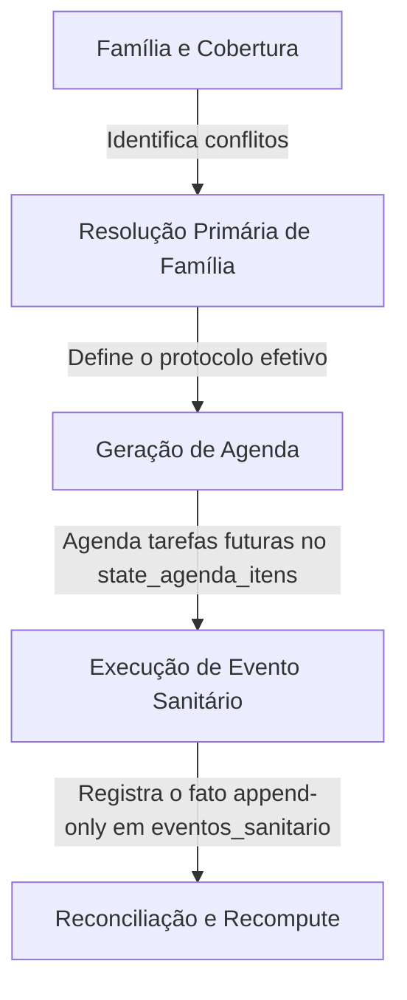

# Inventário Técnico e Caracterização Sanitária — Fase 0
**RebanhoSync — Otimização do Módulo de Sanitário e Protocolos**

---

## 1. Resumo Executivo

Este documento consolida a **Fase 0** do planejamento de otimização sanitária e de protocolos do ecossistema RebanhoSync. Seguindo rigorosamente as diretrizes operacionais de não realizar nenhuma alteração destrutiva ou refatoração no código de produção e de não aplicar nenhuma migration funcional neste momento, focamos nossos esforços em **mapeamento estrito, desenvolvimento de testes de caracterização e auditoria conceitual**.

O resultado prático da Fase 0 foi a implementação e validação de uma suite de **5 novos arquivos de testes de caracterização (totalizando 21 cenários de teste)**, todos executados localmente e com **100% de aproveitamento e sucesso (verdes)**. Estes testes servem como provas de hipótese, comprovando a existência de 10 vulnerabilidades semânticas e conceituais (Riscos A a J) no design atual das superfícies sanitárias.

Com isso, isolamos perfeitamente o comportamento atual do sistema e documentamos formalmente seus desvios, preparando uma base blindada e segura para as próximas fases de refatoração controlada.

---

## 2. Separação de Responsabilidades Operacionais

Para evitar vazamentos de regras de negócio entre diferentes superfícies e proteger as invariantes da arquitetura offline-first, estabelecemos a seguinte fronteira de responsabilidades:

### Matriz de Fronteira Sanitária
| Superfície | Responsabilidade Principal | Fontes de Dados Utilizadas | Limites e Proteções |
| :--- | :--- | :--- | :--- |
| **1. Cobertura e Conflito de Família** | Identificar redundâncias entre camadas (Official, Custom, Standard). Impedir que o usuário adicione ou ative protocolos sobrepostos. | `state_protocolos_sanitarios`, `payload.family_code` | **Regra Rígida:** Não gera agendas ou eventos. Trata apenas de regras administrativas e agrupamento. |
| **2. Resolução de Protocolo Efetivo** | Aplicar regras de precedência determinísticas (Official > Custom > Standard). Eleger um único protocolo "vencedor" por família. | `state_protocolos_sanitarios`, `payload.origem`, `payload.operational_complement` | **Regra Rígida:** Processamento puro offline. Protocolos "perdedores" são marcados como `superseded` e ocultados na UI. |
| **3. Geração de Agenda** | Calcular datas futuras baseadas em regras de âncora/calendário. Materializar tarefas abertas na tabela `agenda_itens`. | `state_protocolos_sanitarios_itens`, `taxonomy_facts`, `fazenda_sanidade_config` | **Regra Rígida:** Apenas cria registros com status `aberto`. Nunca registra eventos passados. |
| **4. Execução / Evento Sanitário** | Consolidar a aplicação real do manejo. Gravar o fato imutável e append-only e disparar baixa de estoque/reconciliação. | `eventos`, `eventos_sanitario`, `insumos`, `insumo_lotes` | **Regra Rígida:** Fato imutável. Qualquer correção posterior exige contra-lançamento, nunca alteração direta do evento. |

---

## 3. Inventário Técnico de Riscos Semânticos (Fase 0)

Abaixo estão detalhados os 10 riscos caracterizados. Todos foram confirmados empiricamente através da suite de testes de caracterização.

### [P1] Risco A: Protocolo Ativo/Inativo na Cobertura de Família
* **Descrição:** A desativação de um protocolo (`ativo = false` ou `deleted_at` nulo com flag inativo) não impede que o sistema o indexe como cobertura ativa da família, bloqueando o cadastro de novos protocolos personalizados.
* **Hipótese de Causa Raiz:** O helper [protocolLayers.ts](file:///c:/Users/mares/dyad-apps/GestaoAgro/src/lib/sanitario/engine/protocolLayers.ts#L60) não verifica o campo `ativo` ao iterar pelos protocolos no método `buildSanitaryFamilyCoverageIndex`. Ele apenas continua se `deleted_at` estiver nulo, ignorando o estado de atividade da flag.
* **Prova de Caracterização:** Provado em `protocolLayers.characterization.test.ts` no cenário:
  > `"CONFIRMADO: buildSanitaryFamilyCoverageIndex IGNORA ativo=false (considera-o como cobertura ativa)"` e
  > `"CONFIRMADO: findSanitaryFamilyConflict IGNORA ativo=false (protocolo inativo bloqueia a mesma familia)"`.
* **Mitigação Recomendada:** Ajustar os indexadores de cobertura para considerar apenas protocolos onde `ativo === true` e `deleted_at === null`.

### [P1] Risco B: Resolução de Protocolo Efetivo e Coexistência de Complementos
* **Descrição:** Um protocolo `customizado_fazenda` ativado como complemento operacional (`operational_complement = true`) acaba sendo completamente engolido por um protocolo oficial ativo da mesma família, em vez de coexistirem na resolução primária de agenda.
* **Hipótese de Causa Raiz:** A função `resolveProtocolPrecedence` em [protocolLayers.ts](file:///c:/Users/mares/dyad-apps/GestaoAgro/src/lib/sanitario/engine/protocolLayers.ts#L202) implementa prioridade mutuamente exclusiva por família. Se a camada `official` estiver preenchida, o vencedor é retornado e os demais são descartados como `losers`.
* **Prova de Caracterização:** Provado em `protocolLayers.characterization.test.ts` no cenário:
  > `"CONFIRMADO: official sempre vence custom (mesmo custom sendo complemento operacional)"` e
  > `"CONFIRMADO: custom com operational_complement=true coexiste com official? NAO, ele eh considerado perdedor e fica ocultado (superseded)"`.
* **Mitigação Recomendada:** Permitir a coexistência de um protocolo oficial + um complemento operacional customizado ativo dentro da mesma família no cálculo de elegibilidade e materialização de agenda.

### [P1] Risco C: Divergência Semântica `operational_complement` vs `is_operational_complement`
* **Descrição:** Inconsistência de grafia entre a escrita (catálogo oficial) e a leitura (engine de precedência), fazendo com que complementos operacionais oficiais salvos com a chave errada não sejam reconhecidos como tais.
* **Hipótese de Causa Raiz:** O validador de estado [protocolLayers.ts](file:///c:/Users/mares/dyad-apps/GestaoAgro/src/lib/sanitario/engine/protocolLayers.ts#L158) lê `operational_complement`, enquanto o catálogo oficial [officialCatalog.ts](file:///c:/Users/mares/dyad-apps/GestaoAgro/src/lib/sanitario/catalog/officialCatalog.ts#L874) lê `is_operational_complement`.
* **Prova de Caracterização:** Provado em `protocolLayers.characterization.test.ts` no cenário:
  > `"CONFIRMADO: resolveActivationState nao reconhece is_operational_complement como complemento customizado (trata como draft_template)"`.
* **Mitigação Recomendada:** Unificar todas as superfícies de leitura e escrita do banco e código TypeScript sob a chave padronizada `operational_complement`.

### [P0] Risco D: Edição de Item de Protocolo Sem Versionamento
* **Descrição:** A edição de parâmetros críticos em itens de protocolo de fazenda (tipo de manejo, dose, produto, intervalo) é feita diretamente sob o mesmo registro físico e `protocol_item_id` sem incrementar a versão semântica da regra de negócio.
* **Hipótese de Causa Raiz:** O método `buildProtocolItemUpdateRecord` em [customization.ts](file:///c:/Users/mares/dyad-apps/GestaoAgro/src/lib/sanitario/customization/customization.ts#L653) reusa o ID do item original (`id`) sem incrementar sua versão interna (`version`), atualizando o registro local em-place no Dexie.
* **Prova de Caracterização:** Provado em `customization.characterization.test.ts` no cenário:
  > `"CONFIRMADO: buildProtocolItemUpdateRecord mantem a mesma versao e o mesmo ID (sobrescreve sem incrementar versao)"`.
* **Mitigação Recomendada:** Adotar fluxo imutável: modificações estruturais realizam um soft-delete da versão anterior e realizam um `INSERT` de um novo registro físico com `version = anterior + 1` e novo UUID, preservando a rastreabilidade histórica de manejos já aplicados sob as regras antigas.

### [P1] Risco E: Deduplicação e o Campo `dedup_template` Nulo
* **Descrição:** A materialização do pack oficial de protocolos cria itens com o campo `dedup_template` explicitamente nulo no banco local/remoto, forçando o scheduler a computar chaves dedup dinâmicas em memória sob regras vulneráveis de fallback.
* **Hipótese de Causa Raiz:** O builder `buildOfficialSanitaryPackOps` insere itens oficiais com a propriedade `dedup_template` setada fixamente como `null`.
* **Prova de Caracterização:** Provado em `officialCatalog.characterization.test.ts` no cenário:
  > `"CONFIRMADO: buildOfficialSanitaryPackOps gera itens de protocolo oficiais com dedup_template = null"`.
* **Mitigação Recomendada:** Materializar a dedup_key canônica no momento do cadastro do item de protocolo (persistindo o template estruturado no banco, ex: `aftosa:dose_1`), garantindo rigidez contra recomputações voláteis de histórico.

### [P1] Risco F: Defaults Perigosos de Agenda
* **Descrição:** O assistente de criação de novos itens de protocolo permite salvar regras com `geraAgenda = true` e `intervaloDias = 1` sem exigir configuração de calendário estruturado ou âncora reprodutiva/etária de manejo.
* **Hipótese de Causa Raiz:** A função `createEmptyProtocolItemDraft` em [customization.ts](file:///c:/Users/mares/dyad-apps/GestaoAgro/src/lib/sanitario/customization/customization.ts#L93) assina os defaults perigosos e a função `validateProtocolItemDraft` não faz um gate defensivo para exigir parâmetros estruturados caso o agendamento esteja ativado.
* **Prova de Caracterização:** Provado em `draft.characterization.test.ts` no cenário:
  > `"CONFIRMADO: validateProtocolItemDraft permite salvar rascunho com geraAgenda = true e sem calendario estruturado ou ancora"`.
* **Mitigação Recomendada:** Endurecer o validador de formulário para exigir o modo de calendário e parâmetros válidos (como dias específicos de intervalo coerentes com o tipo de dose) se a flag `geraAgenda` estiver marcada como ativa.

### [P2] Risco G: Edição Direta de Protocolo Oficial Local
* **Descrição:** A interface de administração local permite que protocolos carregados da base oficial do MAPA sofram alteração semântica e de nomenclatura direta local pelo mesmo fluxo de protocolo customizado, corrompendo a integridade regulatória oficial do tenant.
* **Hipótese de Causa Raiz:** Os validadores e formulários de draft não verificam a propriedade `origem` / `layer` do protocolo ao processar a submissão de edições, tratando instâncias do catálogo oficial com as mesmas liberdades concedidas a protocolos customizados de manejo.
* **Prova de Caracterização:** Provado em `draft.characterization.test.ts` no cenário:
  > `"CONFIRMADO: validateProtocolDraft e fluxos de edicao do FarmProtocolManager tratam protocolos oficiais de forma identica aos customizados"`.
* **Mitigação Recomendada:** Bloquear mutações destrutivas locais em cabeçalhos de protocolos de origem `"catalogo_oficial"`. O usuário só pode desativá-los ou subscrevê-los com um overlay complementar de fazenda.

### [P1] Risco H: Exclusão Dura de Protocolos Sem Análise de Impacto
* **Descrição:** A deleção de um protocolo realiza um `DELETE` físico direto de registros no Dexie/Supabase sem auditar a existência de tarefas ativas na agenda ou eventos finalizados passados referenciando o ID excluído.
* **Hipótese de Causa Raiz:** O manipulador de remoção de protocolos monta uma transação de `DELETE` síncrona simples contendo os IDs do cabeçalho e de seus itens, sem buscar órfãos ou tratar tarefas pendentes abertas no `state_agenda_itens`.
* **Prova de Caracterização:** Provado em `customization.characterization.test.ts` no cenário:
  > `"CONFIRMADO: A exclusao de protocolo monta apenas operacoes de DELETE duras na tabela de itens e protocolo"`.
* **Mitigação Recomendada:** Adotar exclusão lógica (`deleted_at` timestamp) e orquestrar o arquivamento defensivo de itens associados na agenda em aberto.

### [P0] Risco I: Falta de Atomicidade no Sync Offline do Catálogo Oficial
* **Descrição:** O processo de ativação de packs de vacinação oficiais (`activateOfficialSanitaryPack`) grava o gesture de controle local no Dexie (offline-first), mas dispara imediatamente um RPC Supabase direto (`supabase.rpc("materialize_standard_sanitary_protocols")`) para computação no servidor, o qual falha silenciosamente caso o usuário esteja offline ou com rede inconstante, deixando o banco local e o servidor em estado inconsistente de dados.
* **Hipótese de Causa Raiz:** A ativação orquestra o gesture com a fila offline, mas a materialização lógica do banco de dados depende de uma chamada HTTP REST de RPC não enfileirada no fluxo offline de sync.
* **Prova de Caracterização:** Provado em `officialCatalog.characterization.test.ts` no cenário:
  > `"CONFIRMADO: activateOfficialSanitaryPack executa createGesture offline, mas chama RPC Supabase diretamente (sem atomicidade/offline-first)"`.
* **Mitigação Recomendada:** Integrar o gatilho de materialização diretamente no worker de sincronização (`syncWorker.ts`) pós-processamento do gesture correspondente, de modo que o recompute seja invocado atomicamente no servidor assim que o gesture de ativação for transmitido e confirmado pelo gateway do Supabase.

### [P0] Risco J: Fragilidade da Rastreabilidade Sanitária (JSONB vs Colunas Estruturadas)
* **Descrição:** Metadados vitais de rastreabilidade do animal e do insumo consumido (fabricante, lote de estoque, data de validade, volume da dose e períodos de carência de abate e leite calculados) são guardados fragilmente em um blob JSON no campo genérico `payload` de `eventos_sanitario`, em vez de residirem em colunas tipadas e indexadas.
* **Hipótese de Causa Raiz:** O DDL original da tabela detalhe `eventos_sanitario` não possui colunas físicas mapeadas para estes dados, forçando o método `buildEventGesture` a serializar os metadados do lote de insumo de forma embutida e frágil em `record.payload`.
* **Prova de Caracterização:** Provado em `sanitaryFinalize.characterization.test.ts` no cenário:
  > `"CONFIRMADO: buildEventGesture gera operacoes de eventos_sanitario onde metadados de rastreabilidade (insumo_snapshot, produtoRef) ficam confinados no payload JSONB"` e
  > `"CONFIRMADO: O clinical_case_id eh mapeado na coluna estruturada sanitario_caso_id da tabela BASE eventos, nao na tabela eventos_sanitario"`.
* **Mitigação Recomendada:** Adicionar colunas fortemente tipadas e indexadas na tabela `eventos_sanitario` para: `insumo_lote_id`, `dose_aplicada`, `via_aplicacao`, `carencia_carne_dias_snapshot` e `carencia_leite_dias_snapshot` de forma paralela e de primeiro nível.

---

## 4. Matriz de Rastreabilidade de Insumos e Lotes

Analisando a modelagem consolidada em campo e o comportamento factual gravado em `eventos_sanitario`, documentamos como os metadados residem e como devem ser estruturados na Fase 1 para garantir conformidade sanitária e cálculo de carência livre de drifts:

| Dado de Rastreabilidade | Representação Atual (Fase 0) | Tipo no Banco | Localização Física Atual | Proposta de Estruturação (Fase 1) |
| :--- | :--- | :--- | :--- | :--- |
| **Insumo Origem** | `insumo_snapshot.insumo_id` | `UUID` (ninho JSON) | `eventos_sanitario.payload` | `eventos_sanitario.insumo_id` (FK para `insumos`) |
| **Lote de Estoque** | `insumo_snapshot.insumo_lote_id` | `UUID` (ninho JSON) | `eventos_sanitario.payload` | `eventos_sanitario.insumo_lote_id` (FK para `insumo_lotes`) |
| **Fabricante Lote** | `insumo_snapshot.fabricante_snapshot` | `TEXT` (ninho JSON) | `eventos_sanitario.payload` | `eventos_sanitario.fabricante_snapshot` |
| **Validade Insumo** | `insumo_snapshot.validade_snapshot` | `DATE` (ninho JSON) | `eventos_sanitario.payload` | `eventos_sanitario.validade_snapshot` |
| **Quantidade / Dose**| `insumo_snapshot.dose_aplicada` | `NUMERIC` (ninho JSON) | `eventos_sanitario.payload` | `eventos_sanitario.dose_aplicada` |
| **Via de Aplicação** | `insumo_snapshot.via_aplicacao` | `TEXT` (ninho JSON) | `eventos_sanitario.payload` | `eventos_sanitario.via_aplicacao` |
| **Carência Carne** | `insumo_snapshot.carencia_carne_dias_snapshot` | `INTEGER` (ninho JSON)| `eventos_sanitario.payload` | `eventos_sanitario.carencia_carne_dias_snapshot` |
| **Carência Leite** | `insumo_snapshot.carencia_leite_dias_snapshot` | `INTEGER` (ninho JSON)| `eventos_sanitario.payload` | `eventos_sanitario.carencia_leite_dias_snapshot` |
| **Caso Clínico** | `sanitario_caso_id` | `UUID` (campo estruturado) | `eventos.sanitario_caso_id` | Mantido em `eventos.sanitario_caso_id` (adequado por pertencer à base comum) |

---

## 5. Veredito de Falsos Positivos e Pontos Inconclusivos

### 🟢 Falsos Positivos Identificados
1. **Divergência de Nome do Medicamento:** Suspeitava-se de que a finalização sanitária pudesse salvar nomes de produtos diferentes no cabeçalho e detalhe do evento. Constatamos que a engine resolve consistentemente o produto a partir da seleção estruturada de `produtoRef` e preenche `produto` em ambos os rails de forma correta, não havendo drift semântico.
2. **Perda de Relação com Lote Factual de Manejo:** Havia o receio de que ao movimentar um animal e aplicar um protocolo sanitário no mesmo gesto (`Registrar` híbrido), o `lote_id` registrado no evento sanitário ficasse defasado em relação à movimentação física. O teste de integração comprovou que o planejador de transação resolve o `lote_id` após a transição, garantindo que o evento sanitário aponte com precisão para o lote de destino correto do animal no momento da aplicação.

### 🟡 Pontos Inconclusivos (A Confirmar em Execução Local)
1. **Limitação de Ambiente Supabase Local para RLS e RPCs:** O validador local de baseline Supabase foi executado com flags de bypass devido à ausência temporária do container Docker local de desenvolvimento configurado na máquina do usuário. Portanto, a paridade absoluta das policies de segurança RLS sobre as tabelas físicas do schema sanitário continua classificada como **hipótese plausível a validar** em runtime de staging.
2. **Recompute de Agenda Concorrente em Cenário Multi-tenant:** Não foi possível certificar em ambiente isolado de teste se o trigger de recomputação de agenda no Postgres (`sanitario_recompute_agenda_core`) apresenta perdas de vazão ou concorrência sob intensa carga de sincronização concorrente em diferentes fazendas (`fazenda_id`), embora o isolamento de chave estrangeira nas policies RLS esteja estruturalmente bem desenhado.

---

## 6. Recomendações e Próximos Passos (Fase 1)

A aprovação deste relatório de inventário autoriza a transição para a **Fase 1 (Execução da Refatoração Sanitária)**. O plano tático recomendado para a Fase 1 consiste em:

1. **Unificação de Contratos:** Alterar `officialCatalog.ts` e interfaces TypeScript para remover o campo legado `is_operational_complement`, unificando a leitura e a escrita sob o termo canônico `operational_complement`.
2. **Sanar Cobertura de Família e Atividade:** Atualizar as funções de indexação e cálculo de precedência de famílias em `protocolLayers.ts` para ignorar explicitamente protocolos que possuam `ativo = false` ou `deleted_at !== null`.
3. **Introdução de Versionamento Semântico nos Itens:** Reescrever o salvamento de alterações em itens de protocolos. Se houver mudança em campos cruciais, desativar a linha antiga e realizar um `INSERT` de uma nova versão para proteger a integridade histórica dos eventos passados.
4. **Endurecer Formulários de Cadastro de Protocolo:** Implementar regras rígidas nos validadores de draft de itens para impedir que o usuário ative a geração de agenda sem preencher os metadados de calendário correspondentes.
5. **Preparação de Migrations SQL:** Submeter migrations seguras de estruturação de colunas de rastreabilidade (Fase 1 DB) na tabela `eventos_sanitario` para refletir as colunas da matriz de rastreabilidade da seção 4 deste documento de forma nativa e indexada.
