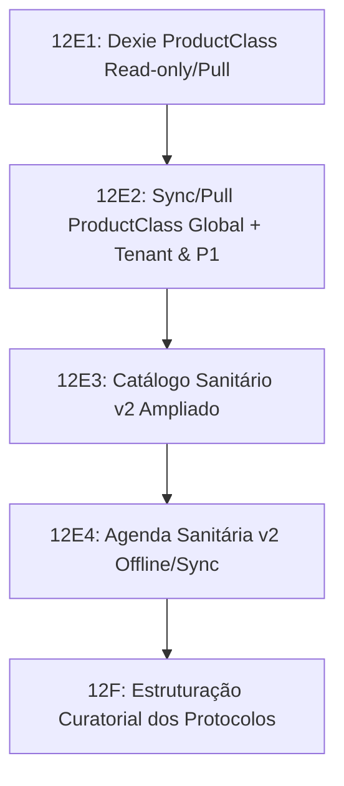

# Plano Técnico — Fase 12E0: Offline/Sync da Fundação Sanitária v2

Este documento estabelece o diagnóstico técnico e o contrato de implementação para conectar as novas estruturas da Fundação Sanitária v2 ao fluxo de offline e sincronização (`sync-batch`) do RebanhoSync.

---

## 1. Estado Atual do Offline/Sync

O ecossistema offline/sync do RebanhoSync é projetado em torno do princípio **Offline-First**, estruturado em duas vias principais:
1. **State Rails (`state_*`)**: Cópia local (IndexedDB via Dexie) das tabelas remotas do Postgres/Supabase, otimizada para leituras instantâneas na UI.
2. **Event Rails (`event_*`)**: Registros append-only de fatos históricos executados. Correções são feitas via contra-lançamentos, garantindo a rastreabilidade.

### Fluxo de Sincronização (`sync-batch`)
- **Gestures (`queue_gestures`)**: Representama transações atômicas criadas localmente pelo usuário.
- **Operations (`queue_ops`)**: Operações individuais (`INSERT`, `UPDATE`, `DELETE`) de uma transação.
- **Sync Worker (`syncWorker.ts`)**:
  1. Identifica transações locais em estado `PENDING`.
  2. Envia um payload JSON com as operações ordenadas para a Edge Function remota `/sync-batch`.
  3. A Edge Function executa as operações no Supabase com o contexto de segurança (JWT) do usuário, aplicando diretamente as políticas de **RLS** (Row Level Security).
  4. Em caso de sucesso (`APPLIED` / `APPLIED_ALTERED`), o Sync Worker executa um *post-sync pull* (`pull.ts`) para recarregar as tabelas alteradas e atualizar o estado local.
  5. Se houver qualquer rejeição (`REJECTED`), a transação é marcada como `REJECTED`, as rejeições são inseridas em `queue_rejections` e as operações locais são desfeitas (*rolled back*) deterministicamente.

---

## 2. Estruturas Remotas Existentes (Supabase)

A Fundação Sanitária v2 é composta por 17 estruturas no banco de dados, divididas em dois blocos funcionais:

### Bloco A — Catálogo Sanitário v2 (14 tabelas)
1. **ProductClass** (4 tabelas):
   - `sanitario_product_classes_v2`: Classes técnicas sanitárias.
   - `sanitario_product_class_groups_v2`: Grupos curados de classes aceitas.
   - `sanitario_product_class_group_members_v2`: Relacionamento de classes aceitas no grupo.
   - `sanitario_product_class_default_rules_v2`: Regras e defaults de aplicação/carência da classe.
2. **Fontes Técnicas** (2 tabelas):
   - `sanitario_fontes_tecnicas_v2`: Fontes bibliográficas, normas oficiais, bulas ou responsáveis técnicos.
   - `sanitario_fonte_cobertura_campos_v2`: Cobertura de campos críticos por fonte.
3. **Produtos Veterinários** (6 tabelas):
   - `sanitario_produtos_v2`: Produto veterinário/sanitário canônico.
   - `sanitario_produto_especie_autorizacao_v2`: Regras de autorização por espécie e aptidão.
   - `sanitario_produto_fontes_v2`: Associação de fontes técnicas a campos do produto.
   - `sanitario_produto_dose_rules_v2`: Regras estruturadas de dose e via.
   - `sanitario_produto_carencia_rules_v2`: Regras de carência ativa carne/leite.
   - `sanitario_produto_carencia_fontes_v2`: Fontes específicas associadas às regras de carência.
4. **Protocolos** (2 tabelas):
   - `sanitario_protocolos_v2`: Protocolos operacionais do rebanho.
   - `sanitario_protocolo_itens_versions_v2`: Itens e etapas lógicas versionadas dos protocolos.

### Bloco B — Operação Sanitária v2 (3 tabelas)
1. `sanitario_agenda_v2`: Agenda Sanitária v2 (intenção futura persistida).
2. `sanitario_agenda_animais_v2`: Animais planejados/agendados.
3. `sanitario_agenda_closures_v2`: Fechamento administrativo de agenda (dispensada/cancelada/executada).

---

## 3. Stores Dexie Atuais e Lacunas

Nenhuma das 17 tabelas v2 listadas no item anterior possui store correspondente no Dexie (`src/lib/offline/db.ts`). A versão atual (v22) do schema Dexie ainda depende de estruturas sanitárias legadas (`state_protocolos_sanitarios`, `state_protocolos_sanitarios_itens` e `catalog_produtos_veterinarios`).

---

## 4. Mapa Remoto → Local Proposto

Para integrar as estruturas v2, mapearemos as tabelas do Supabase para os seguintes stores Dexie (com PK e índices sugeridos):

| Tabela Remota (Supabase) | Store Local (Dexie) | Primary Key & Índices Propostos (Dexie Schema) |
|---|---|---|
| `sanitario_product_classes_v2` | `catalog_sanitario_product_classes_v2` | `id, scope, class_key, curation_status, deleted_at` |
| `sanitario_product_class_groups_v2` | `catalog_sanitario_product_class_groups_v2` | `id, scope, group_key, curation_status, deleted_at` |
| `sanitario_product_class_group_members_v2` | `catalog_sanitario_product_class_group_members_v2` | `id, scope, group_id, class_id, deleted_at` |
| `sanitario_product_class_default_rules_v2` | `catalog_sanitario_product_class_default_rules_v2` | `id, scope, class_id, [species_code+aptitude], deleted_at` |
| `sanitario_fontes_tecnicas_v2` | `catalog_sanitario_fontes_tecnicas_v2` | `id, scope, fazenda_id, kind, deleted_at` |
| `sanitario_fonte_cobertura_campos_v2` | `catalog_sanitario_fonte_cobertura_campos_v2` | `id, source_id, field_key, deleted_at` |
| `sanitario_produtos_v2` | `catalog_sanitario_produtos_v2` | `id, status_curatorial, deleted_at` |
| `sanitario_produto_especie_autorizacao_v2` | `catalog_sanitario_produto_especie_autorizacao_v2` | `id, product_id, species_code, authorization_status, deleted_at` |
| `sanitario_produto_fontes_v2` | `catalog_sanitario_produto_fontes_v2` | `[product_id+source_id+field_key]` |
| `sanitario_produto_dose_rules_v2` | `catalog_sanitario_produto_dose_rules_v2` | `id, product_id, species_code, deleted_at` |
| `sanitario_produto_carencia_rules_v2` | `catalog_sanitario_produto_carencia_rules_v2` | `id, product_id, species_code, applicability, deleted_at` |
| `sanitario_produto_carencia_fontes_v2` | `catalog_sanitario_produto_carencia_fontes_v2` | `[withdrawal_rule_id+source_id+field_key]` |
| `sanitario_protocolos_v2` | `state_sanitario_protocolos_v2` | `id, scope, fazenda_id, status, approval_status, deleted_at` |
| `sanitario_protocolo_itens_versions_v2` | `state_sanitario_protocolo_itens_versions_v2` | `id, protocol_id, logical_item_key, version, status, deleted_at` |
| `sanitario_agenda_v2` | `state_sanitario_agenda_v2` | `id, fazenda_id, status, dedup_key, client_op_id, data_programada, deleted_at` |
| `sanitario_agenda_animais_v2` | `state_sanitario_agenda_animais_v2` | `[agenda_id+animal_id], fazenda_id, animal_id, planned_status, execution_evento_id` |
| `sanitario_agenda_closures_v2` | `state_sanitario_agenda_closures_v2` | `id, fazenda_id, agenda_id, closure_type, dedup_key, client_op_id, deleted_at` |

---

## 5. Estratégia para Registros Globais

Registros globais representam catálogos de apoio estruturados pela equipe curatorial (como classes de produtos, regras padrão e diretrizes sanitárias nacionais/estaduais). Eles possuem `scope = 'global'` e `fazenda_id is null`.

- **Puxada (Pull)**:
  - O fluxo clássico de puxada por fazenda (`pullDataForFarm`) falhará em trazer registros globais porque filtra via `.eq("fazenda_id", fazenda_id)`.
  - **Solução**: Implementar pull complementar que filtre `scope = 'global'` ou `fazenda_id is null` para catálogos sanitários no carregamento inicial da aplicação.
- **Push Bloqueado (Pull-Only)**:
  - Tabelas de catálogo com `scope = 'global'` são **strictly pull-only**. Elas **nunca** devem gerar registros na fila de escrita (`queue_ops`).
  - No cliente, bloquearemos localmente qualquer tentativa de escrita nessas tabelas para evitar desvios locais em relação ao catálogo master.

---

## 6. Estratégia para Registros Tenant

Registros tenant pertencem a uma fazenda específica e possuem `scope = 'tenant'` com `fazenda_id is not null`. Exemplos: protocolos customizados da fazenda, agendas e closures.

- **Puxada (Pull)**:
  - Segue o fluxo padrão de pull filtrado por `fazenda_id` ativo da sessão.
- **Push**:
  - Quando criados ou alterados offline, operações correspondentes de `INSERT`, `UPDATE` ou `DELETE` são gravadas em `queue_ops`.
  - O Sync Worker do cliente garante a conformidade e normalização do payload injetando `fazenda_id` e enviando-as ao `/sync-batch`.
  - **Políticas de Acesso e Escrita**:
    - Catálogos/configurações tenant-scoped (`scope = 'tenant'`) podem admitir push restrito a `owner`/`manager` quando forem fontes configuráveis (ex: protocolos customizados tenant).
    - Eventos (`event_*`) e intenções/comandos operacionais (`sanitario_agenda_v2` / `sanitario_agenda_closures_v2`) podem admitir push conforme as permissões de cargos operacionais permitidos pelo enum/policy vigente e os respectivos contratos de idempotência.
    - **Regra Central**: `state_*` é estritamente pull/read-model (estado atual derivado). O cliente **nunca** deve usar `state_*` como superfície de push funcional direta na 12E, preservando o modelo "Two Rails" (eventos/intenções operacionais como fonte de escrita e `state_*` como cópia de leitura derivada atualizada após sync/pull controlado).

---

## 7. Estratégia para Soft-delete

Todas as novas tabelas suportam soft-deletion por coluna `deleted_at`.
- **Exclusão Local**: Em vez de invocar `table.delete(id)` no Dexie, a interface/controller local marcará o campo `deleted_at` com o timestamp atual.
- **Envio ao Servidor**: O Sync Worker traduzirá a ação `DELETE` local em uma operação de `UPDATE` configurando `deleted_at = now()` no servidor.
- **Resolução de Consultas**: A UI e os validadores offline filtrarão explicitamente registros ativos: `deleted_at is null`.

---

## 8. Estratégia para RLS e Conflitos

- **Row Level Security (RLS)**:
  - `/sync-batch` opera com o JWT Bearer do usuário. RLS restringe criações/edições de tabelas de configuração a perfis `owner` ou `manager` (conforme policies do Postgres).
- **Conflitos Local-Remoto**:
  - Idempotência é mantida por `client_op_id` e chaves de deduplicação determinísticas (`dedup_key` em agendas e closures).
  - Em re-tentativas de rede (retries), violações de chave única por `client_op_id` retornarão status `APPLIED` sem causar rollback, garantindo a replayability do sync.

---

## 9. Ordem Recomendada de Implementação (Subfases Curtas)

Para reduzir o risco de acúmulo de complexidade em um único patch, a implementação da Fase 12E foi fatiada em 4 subfases curtas e isoladas, seguidas pela fase curatorial 12F:

### Subfase 12E1 — Dexie ProductClass Read-only/Pull Local
- **Foco**: Definir exclusivamente as 4 tabelas de ProductClass (`sanitario_product_classes_v2`, `sanitario_product_class_groups_v2`, `sanitario_product_class_group_members_v2` e `sanitario_product_class_default_rules_v2`) no Dexie schema v23, com tipos correspondentes e guards.
- **Exclusão**: Protocolos, fontes, produtos e agenda **não** entram nesta etapa de schema.

### Subfase 12E2 — Sync/Pull ProductClass Global + Tenant
- **Foco**: Conectar o fluxo de pull e sync-batch para as tabelas de ProductClass. Resolver a pendência P1 corrigindo o script `validate-supabase-baseline-functional.mjs`.
- **Validação**: Garantir que as tabelas com `scope = 'global'` permaneçam como **pull-only** e não aceitem push offline.

### Subfase 12E3 — Catálogo Técnico Sanitário v2 Ampliado
- **Foco**: Integrar os novos stores Dexie e fluxo de sync para os demais catálogos sanitários: Fontes Técnicas, Produtos Veterinários v2 e Protocolos v2.

### Subfase 12E4 — Agenda Sanitária v2 Offline/Sync
- **Foco**: Integração completa da nova Agenda Sanitária, Animais da Agenda e Closures (`sanitario_agenda_v2`, `sanitario_agenda_animais_v2` e `sanitario_agenda_closures_v2`), incluindo geração de comandos (`agenda_intent`, `agenda_closure_intent`) e validação de idempotência.

### Fase 12F — Estruturação Curatorial dos Protocolos
- **Foco**: Carga e validação curatorial (seeds e validação veterinária operacional final) para os protocolos no catálogo, abrindo caminho para a conexão com a interface de usuário.

---

## 10. Testes Obrigatórios por Subfase

### Testes da 12E1
- Validar atualização do IndexedDB para a versão 23.
- Assertar inserção e leitura local dos registros das 4 tabelas de ProductClass.

### Testes da 12E2
- Testar pull diferenciado de ProductClass globais (sem `fazenda_id`) e tenant.
- Testar bloqueio local de push para ProductClass globais.
- Validar `validate-supabase-baseline-functional.mjs` com sucesso.

### Testes da 12E3
- Testar integridade de Snapshots de produtos, autorização de espécies (bloqueando herança bovina/bubalina) e regras de dose.

### Testes da 12E4
- Testar idempotência de sync-batch para duplicatas de `client_op_id` em agendas e closures.
- Validar rollback automático de transação quando uma operação de closure for rejeitada pelo servidor.

---

## 11. Riscos Identificados

| Nível | Risco | Mitigação |
|---|---|---|
| `P0` | **Drift de Filtro Global** (Tentar puxar catálogos globais usando `fazenda_id` resultará em cache local vazio). | Implementar pull explícito de escopo global no carregamento inicial da aplicação. |
| `P1` | **Falsa Colisão de Agenda** (Manejadores diferentes tentando sincronizar closures da mesma agenda com `client_op_id` diferentes). | Preservar a constraint `ux_sanitario_agenda_closures_v2_agenda_active` de forma que o primeiro closure ganhe e o segundo seja rejeitado deterministicamente como conflito de estado. |
| `P2` | **Poluição do IndexedDB** (Acúmulo de registros com soft-delete `deleted_at is not null` prejudicando buscas locais). | Criar índices parciais no Dexie ou usar filtragem ativa baseada em queries de intervalo de tempo. |

---

## 12. Critérios de Aceite para Avançar

- [x] Plano técnico 12E0 validado e aprovado.
- [x] Mapeamento de 17 estruturas detalhado por Catálogo vs Operação.
- [x] Definição de `scope = 'tenant'` e pull-only para `scope = 'global'` consolidada.
- [x] Fatiamento da Fase 12E em 4 subfases curtas (12E1 a 12E4) e Fase 12F estabelecido.
- [x] Nenhuma linha de código funcional alterada.
- [x] Próxima fase autorizada: **12E1 — Dexie schema/stores para ProductClass v2**.
