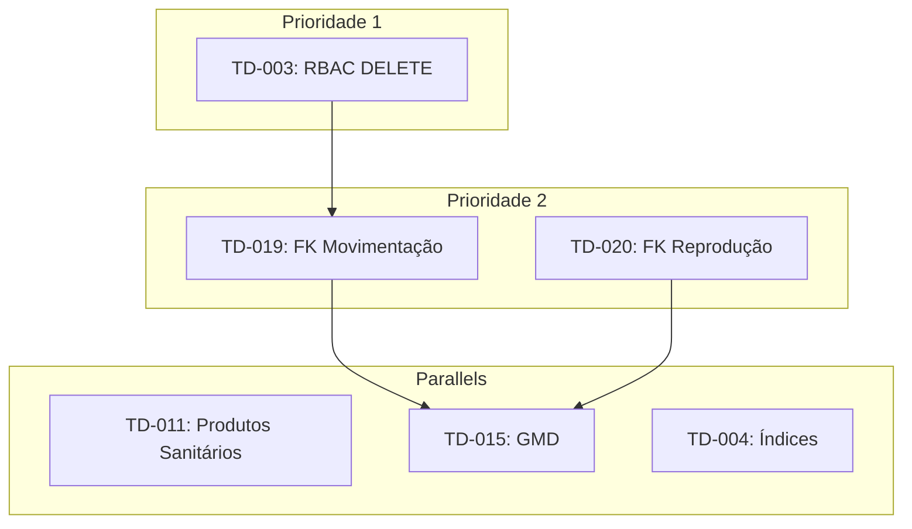
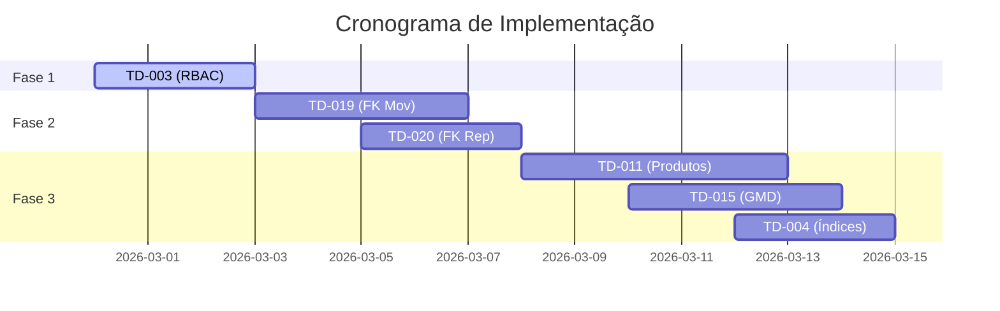

# Análise de Planejamento: Prioridades 1 e 2

> **Data:** 2026-02-27  
> **Contexto:** Capability Score 78.9% (15/19), 6 items de Technical Debt OPEN

---

## 1. Mapeamento de Dependências entre Gaps

### 1.1 Gaps Atuais e Suas Camadas

| Gap ID | capability_id | Camada Afetada | Dependências |
|--------|---------------|----------------|--------------|
| G-01 | `sanitario.registro` | UIW (Frontend) | Nenhuma |
| G-02 | `pesagem.historico` | UIR (Dashboard) | TD-015 |
| G-03 | `movimentacao.registro` | DB (FKs) | TD-019 |
| G-04 | `reproducao.registro` | DB (FKs) | TD-020 |

### 1.2 Dependências entre Technical Debts



### 1.3 Análise de Dependencies

| TD | Depende De | Bloqueia |
|----|------------|----------|
| TD-003 | Nenhuma | Nenhuma |
| TD-019 | TD-003 (opcional para rollback) | Nenhuma |
| TD-020 | TD-019 (compartilha padrão) | Nenhuma |
| TD-011 | Nenhuma | Nenhuma |
| TD-015 | TD-019/TD-020 (índices) | Nenhuma |
| TD-004 | Nenhuma | Nenhuma |

---

## 2. Riscos Técnicos e de Integridade Referencial

### 2.1 Riscos Identificados

| Risco | Probabilidade | Impacto | Mitigação |
|-------|--------------|---------|-----------|
| **Dados órfãos em FKs** | Alta | Alto | Verificar dados existentes antes de aplicar constraint |
| **Quebrar DELETE legítimo** | Média | Alto | Testar com owner/manager antes de deploy |
| **Performance degradada com FKs** | Baixa | Médio | Criar índices antes das FKs |
| **Rollback de migration falhar** | Média | Alto | Testar migrations reversíveis em staging |

### 2.2 Riscos Específicos por TD

#### TD-003: RBAC DELETE Hardening
- **Risco:** Usuários Cowboy perderem acesso a funcionalidades legítimas
- **Mitigação:** Validar que todas as operações DELETE para animais são através de gestos (gestures), nunca diretas

#### TD-019: FK Movimentação
- **Risco:** Dados históricos com `from_lote_id` ou `to_lote_id` inválidos
- **Mitigação:** 
  1. Backup dos dados antes da migration
  2. Verificar integridade com query prévia
  3. Usar `VALIDATE` option do PostgreSQL

#### TD-020: FK Reprodução
- **Risco:** Eventos de reprodução com `macho_id`指向 animal deletado
- **Mitigação:** Mesmo padrão do TD-019

---

## 3. Estratégia de Sequência de Desenvolvimento

### 3.1 Fases de Implementação Recomendadas



### 3.2 Detalhamento das Fases

#### Fase 1: RBAC + Validações (3 dias)
| Dia | Atividade | Responsável |
|-----|-----------|-------------|
| 1 | Análise de código atual das policies | Backend |
| 2 | Criar migration TD-003 | Backend |
| 3 | Testes em staging | QA |

#### Fase 2: Foreign Keys (7 dias)
| Dia | Atividade | Responsável |
|-----|-----------|-------------|
| 1-2 | Análise de dados existentes (FKs) | Backend |
| 3-4 | Criar migration TD-019 | Backend |
| 5-6 | Criar migration TD-020 | Backend |
| 7 | Testes de integração | QA |

#### Fase 3: Gaps Não-Bloqueantes (12 dias - pode ser paralelo)
| Atividade | Dependência | Esforço |
|-----------|-------------|---------|
| TD-011: Autocomplete produtos | Nenhuma | Médio |
| TD-015: Otimização GMD | TD-004 (índices) | Alto |
| TD-004: Índices compounds | Nenhuma | Baixo |

---

## 4. Estimativa de Esforço

### 4.1 Esforço por Technical Debt

| TD | Complexidade | Esforço (dias-homem) |Justificativa |
|----|-------------|---------------------|----------------|
| TD-003 | Baixa | 2-3 | Apenas alteração de policy RLS |
| TD-019 | Média | 3-4 | FK com dados existentes |
| TD-020 | Média | 2-3 | FK simples |
| TD-011 | Média | 4-5 | UI + catálogo + sync |
| TD-015 | Alta | 5-7 | View materializada + testes |
| TD-004 | Baixa | 1-2 | Criação de índices |

### 4.2 Total Estimado

| Fase | Esforço Total |
|------|---------------|
| Fase 1 | 2-3 dias |
| Fase 2 | 5-7 dias |
| Fase 3 (paralelo) | 10-14 dias |
| **Total** | **17-24 dias-homem** |

---

## 5. Critérios de Aceitação por Fase

### 5.1 Fase 1: TD-003 (RBAC DELETE)

- [ ] Cowboy recebe erro 403 ao tentar DELETE animal
- [ ] Owner consegue DELETE animal normalmente
- [ ] Manager consegue DELETE animal normalmente
- [ ] Não há regressão em fluxos E2E existentes
- [ ] Testes unitários cobrem o cenário

### 5.2 Fase 2: TD-019 + TD-020 (Foreign Keys)

- [ ] FK `eventos_movimentacao(from_lote_id)` → `lotes(id)` aplicada
- [ ] FK `eventos_movimentacao(to_lote_id)` → `lotes(id)` aplicada
- [ ] FK `eventos_reproducao(macho_id)` → `animais(id)` aplicada
- [ ] Migration reversível (rollback testado)
- [ ] Nenhum dado perdido após aplicação
- [ ] Queries de dashboard continuam funcionando

### 5.3 Fase 3: Gaps Não-Bloqueantes

#### TD-011 (Produtos Sanitários)
- [ ] UI sugere produtos comuns (autocomplete)
- [ ] Campo produto continua funcionando offline
- [ ] Sync com servidor continua funcionando

#### TD-015 (GMD Otimizado)
- [ ] Dashboard carrega em < 2s com 5000 animais
- [ ] Cálculo de GMD continua preciso
- [ ] Dados históricos preservados

#### TD-004 (Índices)
- [ ] Índice `(fazenda_id, occurred_at)` criado
- [ ] Índice `(animal_id, occurred_at)` criado
- [ ] Nenhuma degradação de performance em queries existentes

---

## 6. Estratégia de Execução Paralela

### 6.1 Tasks que Podem Ser Paralelizadas

| Task | Pode iniciar após | Dependência real |
|------|-------------------|------------------|
| TD-011 | Qualquer momento | Nenhuma |
| TD-004 | Qualquer momento | Nenhuma |
| TD-015 | TD-004 | Índices melhoram performance |

### 6.2 Recomendação de Paralelização

```
Timeline Semanal Sugerida:

Semana 1: TD-003 (RBAC) - FOCO PRINCIPAL
Semana 2: TD-019 + TD-020 (FKs) - FOCO PRINCIPAL
Semana 3: TD-011 (autocomplete) - PARALELO
Semana 4: TD-004 (índices) + TD-015 (GMD) - PARALELO
```

---

## 7. Métricas de Sucesso

| Métrica | Antes | Depois (Meta) |
|---------|-------|---------------|
| Capability Score | 78.9% (15/19) | 100% (19/19) |
| Gaps DB | 2 | 0 |
| Gaps UIW | 1 | 0 |
| Gaps UIR | 1 | 0 |
| Tech Debt OPEN | 6 | 0 |

---

## 8. Conclusão e Recomendação Final

### 8.1 Sequência Ótima

1. **TD-003** - Baixo risco, alto impacto em segurança
2. **TD-019 + TD-020** - Integridade referencial, requer cuidado com dados existentes
3. **TD-011 + TD-004** - Podem ser feitos em paralelo, baixo risco
4. **TD-015** - Depende de TD-004, maior complexidade

### 8.2 Fatores de Decisão

- **Urgência:** TD-003 e FKs (TD-019/TD-020) são mais urgentes por impactarem integridade
- **Esforço:** TD-004 (índices) é o mais simples, bom para "quick wins"
- **Risco:** TD-015 tem maior risco, recomenda-se deixar para o final com testes extensivos

### 8.3 Recomendação

Recomenda-se seguir a sequência proposta com foco em:
1. Semanas 1-2: Foco em TD-003 (segurança)
2. Semanas 3-4: Foco em FKs (integridade)
3. Semanas 5-6: Gaps não-bloqueantes em paralelo

Esta abordagem minimiza riscos ao abordar os items de maior impacto primeiro, mantendo flexibilidade para parallizar tarefas de menor risco.