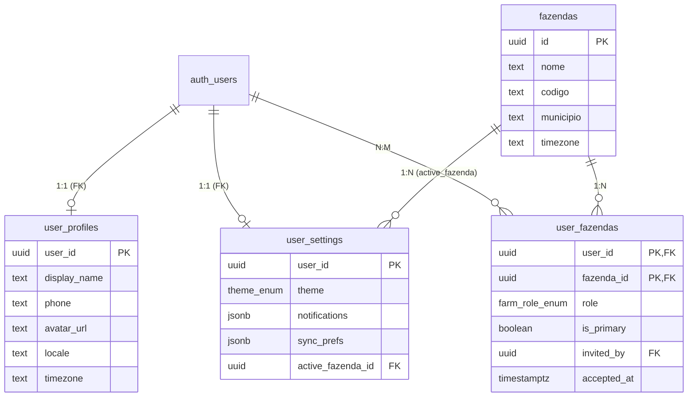
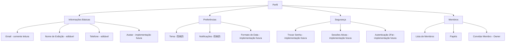

# Análise da Estrutura de Dados do Perfil do Usuário

## Sumário Executivo

Este documento apresenta uma análise detalhada da estrutura de dados relacionada ao gerenciamento do perfil do usuário no sistema GestaoAgro. O mapeamento abrange todas as tabelas, colunas e relacionamentos envolvidos, com especificação dos níveis de visibilidade, editabilidade e metadados de auditoria.

---

## 1. Mapeamento Técnico das Tabelas de Perfil

### 1.1 Tabela: [`user_profiles`](supabase/migrations/0001_init.sql:132)

| Coluna | Tipo de Dados | Nullable | Relacionamento | Visibilidade Atual | Editabilidade | Propósito |
|--------|---------------|----------|----------------|-------------------|--------------|-----------|
| `user_id` | uuid | Não | FK → `auth.users(id)` | Privada | Não (PK) | Identificador único do usuário no sistema |
| `display_name` | text | Sim | N/A | **Pública** (farm-mates) | **Sim** | Nome exibido para outros usuários |
| `phone` | text | Sim | N/A | **Pública** (farm-mates) | **Sim** | Telefone de contato |
| `avatar_url` | text | Sim | N/A | **Pública** (farm-mates) | Sim | URL da foto de perfil |
| `locale` | text | Não | N/A | Privada | Não (default) | Idioma preferido do usuário |
| `timezone` | text | Não | N/A | Privada | Não (default) | Fuso horário do usuário |
| `created_at` | timestamptz | Não | N/A | Auditoria | Não | Data de criação do perfil |
| `updated_at` | timestamptz | Não | N/A | Auditoria | Auto | Data da última atualização |
| `deleted_at` | timestamptz | Sim | N/A | Auditoria | Não | Soft delete |

**Colunas de Sync (Two Rails):**
| Coluna | Tipo | Nullable | Visibilidade | Observações |
|--------|------|----------|-------------|-------------|
| `client_id` | text | Não | Backend | Identifica origem (browser/server) |
| `client_op_id` | uuid | Não | Backend | UUID único da operação (idempotência) |
| `client_tx_id` | uuid | Sim | Backend | UUID da transação |
| `client_recorded_at` | timestamptz | Não | Backend | Quando usuário fez a ação |
| `server_received_at` | timestamptz | Não | Backend | Quando servidor recebeu |

### 1.2 Tabela: [`user_settings`](supabase/migrations/0001_init.sql:159)

| Coluna | Tipo de Dados | Nullable | Relacionamento | Visibilidade Atual | Editabilidade | Propósito |
|--------|---------------|----------|----------------|-------------------|--- -----------|-----------|
| `user_id` | uuid | Não | FK → `auth.users(id)` | Privada | Não (PK) | Identificador do usuário |
| `theme` | theme_enum | Não | N/A | Privada | **Sim** | Tema visual (system/light/dark) |
| `date_format` | text | Não | N/A | Privada | Não (default) | Formato de data |
| `number_format` | text | Não | N/A | Privada | Não (default) | Formato numérico |
| `notifications` | jsonb | Não | N/A | Privada | **Sim** | Preferências de notificação |
| `sync_prefs` | jsonb | Não | N/A | Backend | **Sim** | Preferências de sincronização |
| `active_fazenda_id` | uuid | Sim | FK → `fazendas(id)` | Privada | Sim (via seleção) | Fazenda ativa no momento |
| `created_at` | timestamptz | Não | N/A | Auditoria | Não | Data de criação |
| `updated_at` | timestamptz | Não | N/A | Auditoria | Auto | Data da última atualização |

**Estrutura do JSON `notifications`:**
```json  
{
  "enabled": true,
  "agenda_reminders": true,
  "days_before": [7, 3, 1],
  "quiet_hours": {"start": "22:00", "end": "06:00"}
}
```

**Estrutura do JSON `sync_prefs`:**
```json
{
  "wifi_only": false,
  "background_sync": true,
  "max_batch_size": 500
}
```

### 1.3 Tabela: [`user_fazendas`](supabase/migrations/0001_init.sql:199) (Membership)

| Coluna | Tipo de Dados | Nullable | Relacionamento | Visibilidade Atual | Editabilidade | Propósito |
|--------|---------------|----------|----------------|-------------------|--------------|-----------|
| `user_id` | uuid | Não | FK → `auth.users(id)` | **Pública** (membros) | Não | Usuário membro |
| `fazenda_id` | uuid | Não | FK → `fazendas(id)` | **Pública** (membros) | Não | Fazenda associada |
| `role` | farm_role_enum | Não | N/A | **Pública** (membros) | Owner apenas | Papel do usuário |
| `is_primary` | boolean | Não | N/A | Owner apenas | Owner apenas | Se é o owner principal |
| `invited_by` | uuid | Sim | FK → `auth.users(id)` | Owner apenas | Não | Quem convidou |
| `accepted_at` | timestamptz | Sim | N/A | Owner apenas | Auto | Quando aceitou o convite |
| `created_at` | timestamptz | Não | N/A | Auditoria | Não | Data de criação |
| `updated_at` | timestamptz | Não | N/A | Auditoria | Auto | Data da última atualização |
| `deleted_at` | timestamptz | Sim | N/A | Auditoria | Owner | Soft delete |

### 1.4 Tabela: [`fazendas`](supabase/migrations/0001_init.sql:100) (Dados da Fazenda)

| Coluna | Tipo de Dados | Nullable | Visibilidade | Editabilidade | Propósito |
|--------|---------------|----------|-------------|--------------|-----------|
| `id` | uuid | Não | Membros | Owner | Identificador da fazenda |
| `nome` | text | Não | Membros | Owner/Manager | Nome da `codigo` | text | Sim | Membros | Owner/Manager | fazenda |
| Código identificador |
| `municipio` | text | Sim | Membros | Owner/Manager | Localização |
| `timezone` | text | Não | Membros | Owner/Manager | Fuso horário |
| `metadata` | jsonb | Não | Membros | Owner/Manager | Dados adicionais |
| `created_by` | uuid | Sim | Owner | Não | Quem criou a fazenda |

---

## 2. Relacionamentos entre Tabelas



---

## 3. Políticas de Acesso (RLS)

### 3.1 [`user_profiles`](supabase/migrations/0004_rls_hardening.sql:38)

| Operação | Política | Condição |
|----------|----------|----------|
| SELECT (próprio) | `user_profiles_self` | `user_id = auth.uid()` |
| UPDATE (próprio) | `user_profiles_self` | `user_id = auth.uid()` |
| SELECT (colegas) | `user_profiles_farmmates` | Membro da mesma fazenda |

### 3.2 [`user_settings`](supabase/migrations/0004_rls_hardening.sql:47)

| Operação | Política | Condição |
|----------|----------|----------|
| ALL | `user_settings_self_all` | `user_id = auth.uid()` |

### 3.3 [`user_fazendas`](supabase/migrations/0004_rls_hardening.sql:92)

| Operação | Política | Condição |
|----------|----------|----------|
| SELECT (próprio) | `user_fazendas_select_members` | `user_id = auth.uid()` |
| SELECT (membros) | `user_fazendas_select_members` | Membro da fazenda |
| INSERT/UPDATE/DELETE | **Bloqueado** | Apenas via RPC |

---

## 4. Análise do Menu de Perfil Atual

### 4.1 Página: [`Perfil.tsx`](src/pages/Perfil.tsx:1)

**Informações Visualizadas pelo Usuário:**

| Campo | Valor Atual | Fonte | Editável |
|-------|------------|-------|----------|
| Email | `user.email` | auth.users | ❌ Não (desabilitado) |
| Display Name | `user_profiles.display_name` | user_profiles | ✅ Sim |
| Phone | `user_profiles.phone` | user_profiles | ✅ Sim |

**Ações Disponíveis:**

| Ação | Funcionalidade |
|------|----------------|
| Save Changes | Salva `display_name` e `phone` |
| Switch Farm | Navega para seleção de fazenda |
| Logout | Encerra sessão e limpa dados locais |

### 4.2 Página: [`SignUp.tsx`](src/pages/SignUp.tsx:1)

**Campos coletados no cadastro:**

| Campo | Armazenado em | Obrigatório |
|-------|---------------|-------------|
| Email | auth.users | ✅ Sim |
| Password | auth.users | ✅ Sim |
| Display Name | auth.users.metadata → user_profiles | ✅ Sim |
| Phone | auth.users.metadata → user_profiles | ✅ Sim |

---

## 5. Gaps Identificados

### 5.1 Campos Existentes mas Não Expostos na UI

| Tabela | Campo | Tipo | Razão do Gap |
|--------|-------|------|--------------|
| user_profiles | `avatar_url` | text | Não há UI de upload de avatar |
| user_profiles | `locale` | text | Não exposto, hardcoded como 'pt-BR' |
| user_profiles | `timezone` | text | Não exposto, hardcoded como 'America/Sao_Paulo' |
| user_settings | `theme` | enum | Não há UI de seleção de tema |
| user_settings | `date_format` | text | Não há UI de configuração |
| user_settings | `number_format` | text | Não há UI de configuração |
| user_settings | `notifications` | jsonb | Não há UI de preferências |
| user_settings | `sync_prefs` | jsonb | Não há UI de configuração de sync |
| user_fazendas | `is_primary` | boolean | Não exposto na UI |
| user_fazendas | `invited_by` | uuid | Não exposto na UI |
| user_fazendas | `accepted_at` | timestamptz | Não exposto na UI |
| auth.users | `email_confirmed_at` | timestamptz | Não exposto na UI |
| auth.users | `last_sign_in_at` | timestamptz | Não exposto na UI |

### 5.2 Campos que Poderia Ser Expostos com Novos Níveis de Visibilidade

| Campo | Sugestão de Visibilidade | Motivação |
|-------|-------------------------|-----------|
| `avatar_url` | Visível para membros da fazenda | Identificação visual de colegas |
| `phone` | Visível para membros da fazenda | Comunicação entre equipe |
| `last_sign_in_at` | Privado (apenas own) | Segurança e auditoria |
| `email` | Visível para Owner/Manager | Contato em caso de problemas |
| `role` na user_fazendas | Visível para todos os membros | Clareza de responsabilidades |

---

## 6. Matriz de Permissões de Edição

| Campo | Proprietário | Owner da Fazenda | Manager | Cowboy | Farm-Mates |
|-------|--------------|-----------------|---------|--------|------------|
| `display_name` | ✅ | ❌ | ❌ | ❌ | ❌ |
| `phone` | ✅ | ❌ | ❌ | ❌ | ❌ |
| `avatar_url` | ✅ | ❌ | ❌ | ❌ | ❌ |
| `theme` | ✅ | ❌ | ❌ | ❌ | ❌ |
| `notifications` | ✅ | ❌ | ❌ | ❌ | ❌ |
| `sync_prefs` | ✅ | ❌ | ❌ | ❌ | ❌ |
| `active_fazenda_id` | ✅ | ❌ | ❌ | ❌ | ❌ |
| `role` na fazenda | ❌ | ✅ (promover) | ❌ | ❌ | ❌ |
| `is_primary` | ❌ | ✅ | ❌ | ❌ | ❌ |
| `invited_by` | ❌ | ❌ | ❌ | ❌ | ❌ |

---

## 7. Metadados de Auditoria

### 7.1 Triggers e Funções

| Função | Tabela | Ação |
|--------|--------|------|
| [`set_updated_at()`](supabase/migrations/0001_init.sql:70) | Todas as tabelas de perfil | Auto-atualiza `updated_at` em cada UPDATE |

### 7.2 Campos de Auditoria por Tabela

| Tabela | created_at | updated_at | deleted_at | client_* | Quem criou | Quem alterou |
|--------|-----------|------------|------------|----------|------------|--------------|
| user_profiles | ✅ | ✅ | ✅ | ✅ | auth.users | auth.users |
| user_settings | ✅ | ✅ | ✅ | ✅ | auth.users | auth.users |
| user_fazendas | ✅ | ✅ | ✅ | ✅ | RPC/create_fazenda | RPC/admin_set_member_role |
| fazendas | ✅ | ✅ | ✅ | ✅ | auth.users (created_by) | Owner |

---

## 8. Recomendações de Melhoria

### 8.1 Prioridade Alta - Funcionalidades Essenciais

1. **Upload de Avatar**
   - Adicionar campo `avatar_url` na UI
   - Integrar com Supabase Storage
   - Exibir avatar no SideNav e membros

2. **Seleção de Tema**
   - Expor campo `theme` na UI de perfil
   - Aplicar tema ao app em tempo real

3. **Configurações de Notificação**
   - Criar UI para gerenciar preferências
   - Expor campos: enabled, agenda_reminders, quiet_hours

### 8.2 Prioridade Média - Expansão de Visibilidade

4. **Ver Perfil de Colegas**
   - Página de lista de membros com perfis visíveis
   - Mostrar: nome, avatar, phone

5. **Logout de Outros Dispositivos**
   - UI para ver sessões ativas
   - Encerrar outras sessões remotamente

### 8.3 Prioridade Baixa - Auditoria e Compliance

6. **Histórico de Alterações**
   - Criar tabela `user_profile_history`
   - Rastrear mudanças em campos sensíveis

7. **Configurações Avançadas**
   - Formato de data/hora
   - Formato numérico
   - Idioma da interface

---

## 9. Diagrama de Fluxo do Menu de Perfil



---

## 10. Conclusão

A estrutura de dados atual do perfil do usuário é **minimalista mas funcional**, cobrindo os requisitos básicos de autenticação e associação a fazendas. Os principais gaps identificados são:

1. **Ausência de UI para configurações** - muitas preferências existem no banco mas não são expostas
2. **Falta de visibilidade entre membros** - o sistema não permite ver perfis de colegas

A recomendação é implementar progressivamente as funcionalidades de prioridade alta para melhorar a experiência do usuário e facilitar a colaboração em equipe, utilizando apenas os campos existentes no banco de dados.
